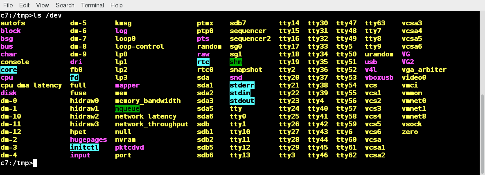
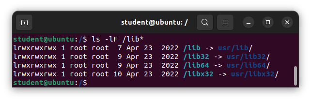
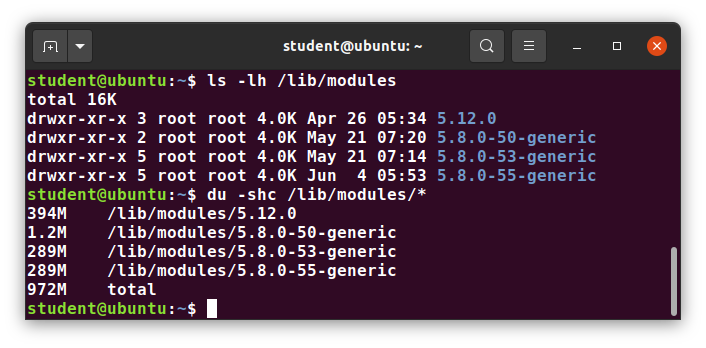
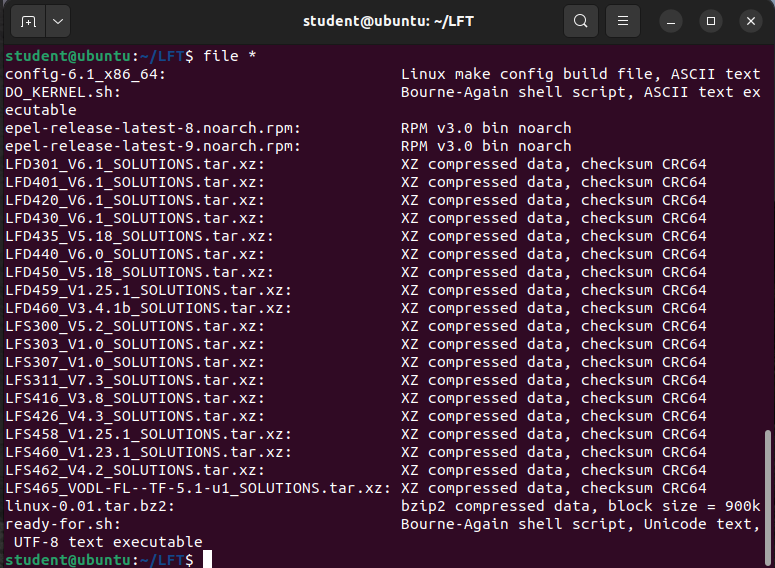

# File Operations

## Introduction to Filesystems
"Everything is a file" is an often repeated adage quoted by users of Linux. Whether you are dealing with normal data files and documents, or with devices such as sound cards and printers, this means interaction with them proceeds through the same Input/Output (I/O) operations you commonly use with files. 

On many systems, the filesystem is structured like a tree. The tree is usually portrayed as inverted and starts at what is most often called the root directory, which marks the beginning of the hierarchical filesystem and is also sometimes referred to as the trunk and simply denoted by /. The root directory is not the same as the root user. The hierarchical filesystem also contains other elements in the path (directory names), which are separated by forward slashes (/), as in /usr/bin/emacs, where the last element is the actual file name.

## Filesystem Varieties
Linux supports a number of native filesystem types, expressly created by Linux developers, such as:
- ext3
- ext4
- squashfs
- btrfs

It also offers implementations of filesystems used on other alien operating systems, such as those from:
- Windows (ntfs, vfat, exfat)
- SGI (xfs)
- IBM (jfs)
- MacOS (hfs, hfs+)

Many older, legacy filesystems, such as FAT, are also supported.

It is often the case that more than one filesystem type is used on a machine, based on considerations such as the size of files, how often they are modified, what kind of hardware they sit on and what kind of access speed is needed, etc. The most advanced filesystem types in common use are the journaling varieties: ext4, xfs, btrfs, and jfs. These have many state-of-the-art features and high performance, and are not easy to corrupt accidentally.

Linux also makes use of network (or distributed) filesystems, where all or part of the filesystem is on external machines.

## Linux Partitions
In most situations, each filesystem on a Linux system occupies a disk partition. Partitions help to organize the contents of disks according to the kind and use of the data contained. For example, important programs required to run the system are often kept on a separate partition (known as root or /) than the one that contains files owned by regular users of that system (/home). In addition, temporary files created and destroyed during the normal operation of Linux may be located on dedicated partitions. One advantage of this kind of isolation by type and variability is that when all available space on a particular partition is exhausted, the system may still operate normally. Furthermore, if data is either corrupted through error or hardware failure, or breached through a security problem, it might be possible to confine problems to an area smaller than the entire system.


## Mount Points
Before you can start using a filesystem, you need to mount it on the filesystem tree at a mount point. This is simply a directory (which may or may not be empty) where the filesystem is to be grafted on. Sometimes, you may need to create the directory if it does not already exist.

If you mount a filesystem on a non-empty directory, the former contents of that directory are covered-up and not accessible until the filesystem is unmounted. Thus, mount points are usually empty directories.


## Mounting and Unmounting
The mount command is used to attach a filesystem (which can be local to the computer or on a network) somewhere within the filesystem tree. The basic arguments are the device node and mount point. For example, `$ sudo mount /dev/sda5 /home` will attach the filesystem contained in the disk partition associated with the /dev/sda5 device node into the filesystem tree at the /home mount point. There are other ways to specify the partition other than the device node, such as using the disk label or UUID (Universally Unique IDentifier).

To unmount the partition, the command would be: `$ sudo umount /home`. Note the command is umount, not unmount! Only a root user (logged in as root, or using sudo) has the privilege to run these commands, unless the system has been otherwise configured.

If you want it to be automatically available every time the system starts up, you need to edit /etc/fstab accordingly (the name is short for filesystem table). Looking at this file will show you the configuration of all pre-configured filesystems. man fstab will display how this file is used and how to configure it.


Executing mount without any arguments will show all presently mounted filesystems.

The command df -Th (disk free) will display information about mounted filesystems, including the filesystem type, and usage statistics about currently used and available space. You may notice a number of entries of type tmpfs. These are not real physical filesystems but are parts of system memory that are represented as such to take advantage of certain programming features.


## NFS and Network Filesystems
It is often necessary to share data across physical systems which may be either in the same location or anywhere that can be reached by the Internet. A network (also sometimes called distributed) filesystem may have all its data on one machine or have it spread out on more than one network node. A variety of different filesystems can be used locally on individual machines; a network filesystem can be thought of as a grouping of lower-level filesystems of varying types.

Many system administrators mount remote home directories on a server in order to give them access to the same files and configuration files across multiple client systems. This allows the users to log in to different computers, yet still have access to the same files and resources.

The most common such filesystem is named simply NFS (the Network Filesystem). It has a very long history and was first developed by Sun Microsystems. Another common implementation is CIFS (also termed SAMBA), which has Microsoft roots. 

### NFS on the Server
On the server machine, NFS uses daemons (built-in networking and service processes in Linux) and other system servers are started at the command line by typing `$ sudo systemctl start nfs`. On some systems, such as RHEL/CentOS, and Fedora, the service is now called nfs-server, not nfs.

The text file /etc/exports contains the directories and permissions that a host is willing to share with other systems over NFS. A very simple entry in this file may look like the following:

```
/projects *.example.com(rw)
```

This entry allows the directory /projects to be mounted using NFS with read and write (rw) permissions and shared with other hosts in the example.com domain. Every file in Linux has three possible permissions: read (r), write (w) and execute (x).

After modifying the /etc/exports file, you can type `exportfs -av` to notify Linux about the directories you are allowing to be remotely mounted using NFS. You can also restart NFS with `sudo systemctl restart nfs`, but this is heavier, as it halts NFS for a short while before starting it up again. To make sure the NFS service starts whenever the system is booted, issue `sudo systemctl enable nfs`.

### NFS on the Client
On the client machine, if it is desired to have the remote filesystem mounted automatically upon system boot, /etc/fstab is modified to accomplish this. For example, an entry in the client's /etc/fstab might look like the following:

```
servername:/projects /mnt/nfs/projects nfs defaults 0 0
```

You can also mount the remote filesystem without a reboot or as a one-time mount by directly using the mount command: `$ sudo mount servername:/projects /mnt/nfs/projects`.

Remember, if /etc/fstab is not modified, this remote mount will not be present the next time the system is restarted. Furthermore, you may want to use the nofail option in fstab in case the NFS server is not live at boot.

## Overview of User Home Directories
Each user has a home directory, usually placed under /home. The /root ("slash-root") directory on modern Linux systems is no more than the home directory of the root user (or superuser or system administrator account).

On multi-user systems, the /home directory infrastructure may be mounted as a separate filesystem on its own partition or even exported (shared) remotely on a network through NFS.

Sometimes, you may group users based on their department or function. You can then create subdirectories under the /home directory for each of these groups. 

## The /bin and /sbin Directories
The /bin directory contains executable binaries, essential commands used to boot the system or in single-user mode, and essential commands required by all system users, such as cat, cp, ls, mv, ps, and rm. Likewise, the /sbin directory is intended for essential binaries related to system administration, such as fsck and ip. 

Commands that are not essential (theoretically) for the system to boot or operate in single-user mode are placed in the /usr/bin and /usr/sbin directories. Historically, this was done so /usr could reside on a separate filesystem that could be mounted at a later stage of system startup or even over a network. However, nowadays most find this distinction to be obsolete. In fact, many distributions have been discovered to be unable to boot with this separation, as this modality had not been used or tested for a long time.

Thus, on most Linux distributions today, /usr/bin and /bin are actually just symbolically linked together, as are /usr/sbin and /sbin, so there are really just two directories, not four.

## The /proc Filesystem
Certain filesystems, like the one mounted at /proc, are called pseudo-filesystems because they have no actual permanent presence anywhere on the disk.

The /proc filesystem contains virtual files (files that exist only in memory) that permit viewing constantly changing kernel data. /proc contains files and directories that mimic kernel structures and configuration information. It does not contain real files, but runtime system information, e.g. system memory, devices mounted, hardware configuration, etc.:
- /proc/cpuinfo
- /proc/interrupts
- /proc/meminfo
- /proc/mounts
- /proc/partitions
- /proc/version

/proc has subdirectories as well, including:

- `/proc/<Process-ID-#>`
- /proc/sys

## The /dev Directory
The /dev directory contains device nodes, a type of pseudo-file used by most hardware and software devices, except for network devices. This directory is:
- Empty on the disk partition when it is not mounted
- Contains entries which are created by the udev system, which creates and manages device nodes on Linux, creating them dynamically when devices are found
  - /dev/sda1 (first partition on the first hard disk)
  - /dev/lp1 (second printer)
  - /dev/random (a source of random numbers)



## The /var Directory
The /var directory contains files that are expected to change in size and content as the system is running (var stands for variable):
- System log files: /var/log
- Packages and database files: /var/lib
- Print queues: /var/spool
- Temporary files: /var/tmp

The /var directory may be put on its own filesystem so that growth of the files can be accommodated and any exploding file sizes do not fatally affect the system. Network services directories such as /var/ftp (the FTP service) and /var/www (the HTTP web service) are also found under /var.

## The /etc Directory
The /etc directory is the home for system configuration files. It contains no binary programs, although there are some executable scripts. For example, /etc/resolv.conf tells the system where to go on the network to obtain host name to IP address mappings (DNS). Files like passwd, shadow and group for managing user accounts are found in the /etc directory. While some distributions have historically had their own extensive infrastructure under /etc, with the advent of systemd there is much more uniformity among distributions today.

Note that /etc is for system-wide configuration files and only the superuser can modify files there. User-specific configuration files are always found under their home directory.

## The /boot Directory
The /boot directory contains the few essential files needed to boot the system. For every alternative kernel installed on the system there are four files:
- vmlinuz
  - The compressed Linux kernel, required for booting.
- initramfs
  - The initial ram filesystem, required for booting, sometimes called initrd, not initramfs.
- config
  - The kernel configuration file, only used for debugging and bookkeeping.
- System.map
  - Kernel symbol table, only used for debugging.

Each of these files has a kernel version appended to its name.

The Grand Unified Bootloader (GRUB) files such as /boot/grub/grub.conf or /boot/grub2/grub2.cfg are also found under the /boot directory.

## The /lib and /lib64 Directories
/lib contains libraries (common code shared by applications and needed for them to run) for the essential programs in /bin and /sbin. These library filenames either start with ld or lib.

Most of these are what is known as dynamically loaded libraries (also known as shared libraries or Shared Objects (SO)). On some Linux distributions there exists a /lib64 directory containing 64-bit libraries, while /lib contains 32-bit versions.

Just like for /bin and /sbin, the directories just point to those under /usr:



Kernel modules (kernel code, often device drivers, that can be loaded and unloaded without re-starting the system) are located in `/lib/modules/<kernel-version-number>`:



## The /media, /run and /mnt Directories
One often uses removable media, such as USB drives, CDs and DVDs. To make the material accessible through the regular filesystem, it has to be mounted at a convenient location. Most Linux systems are configured so any removable media are automatically mounted when the system notices something has been plugged in.

While historically this was done under the /media directory, modern Linux distributions place these mount points under the /run directory. For example, a USB pen drive with a label myusbdrive for a user named student would be mounted at /run/media/student/myusbdrive.

The /mnt directory has been used since the early days of UNIX for temporarily mounting filesystems. These can be those on removable media, but more often might be network filesystems, which are not normally mounted. Or these can be temporary partitions, or so-called loopback filesystems, which are files which pretend to be partitions.

## Additional Directories Under /
| Directory | Usage |
| - | - |
| /opt | Optional application software packages |
| /sys | Virtual pseudo-filesystem giving information about the system and the hardware |
| /srv | Site-specific data served up by the system |
| /tmp | Temporary files <br> On some distributions, it is erased across a reboot and/or may actually be a ramdisk in memory |
| /usr | Multi-user applications, utilities and data |

## The /usr Directory Tree
The /usr directory tree contains theoretically non-essential programs and scripts (in the sense that they should not be needed to initially boot the system) and has at least the following sub-directories:

| Directory | Usage |
| - | - |
| /usr/include | Header files used to compile applications |
| /usr/lib | Libraries for programs in /usr/bin and /usr/sbin |
| /usr/lib64 | 64-bit libraries for 64-bit programs in /usr/bin and /usr/sbin |
| /usr/sbin | Non-essential system binaries, such as system daemons, and scripts |
| /usr/share | Shared data used by applications, generally architecture-independent |
| /usr/src | Source code, usually for the Linux kernel |
| /usr/local | Data and programs specific to the local machine; subdirectories include bin, sbin, lib, share, include, etc. |
| /usr/bin | This is the primary directory of executable programs and scripts |

## Comparing Files with diff
diff is used to compare files and directories. To compare two files, at the command prompt, type `diff [options] <filename1> <filename2>`. This often-used utility program has many useful options:

| Option | Usage |
| - | - |
| -c | Provides a listing of differences that include three lines of context before and after the lines differing in content |
| -r | Used to recursively compare subdirectories, as well as the current directory |
| -i | Ignore the case of letters |
| -w | Ignore differences in spaces and tabs |
| -q | Be quiet: only report if files are different without listing the differences |

diff is meant to be used for text files; for binary files, one can use cmp. 

If you prefer, there are multiple graphical interfaces to diff, including diffuse, vimdiff, and meld.

## Using diff3 and patch
You can compare three files at once using diff3, which uses one file as the reference basis for the other two: `$ diff3 <file1> <file2> <file3>`.

Many modifications to source code and configuration files are distributed utilizing patches. A patch file contains the deltas (changes) required to update an older version of a file to the new one. The patch files are actually produced by running diff with the correct options: `$ diff -Nur originalfile newfile > patchfile`.

To apply a patch, you can just do either of the two methods below:

```
$ patch -p1 < patchfile
$ patch originalfile patchfile
```

The first usage is more common, as it is often used to apply changes to an entire directory tree, rather than just one file, as in the second example.

## Using the file Utility
In Linux, a file's extension does not, by default, categorize its nature the way it might in other operating systems. In Linux, most applications directly examine a file's contents to see what kind of object it is rather than relying on an extension. This is very different from the way Windows handles filenames, where a filename ending with .exe, for example, represents an executable binary file.

The real nature of a file can be ascertained by using the file utility. For the file names given as arguments, it examines the contents and certain characteristics to determine whether the files are plain text, shared libraries, executable programs, scripts, or something else.

