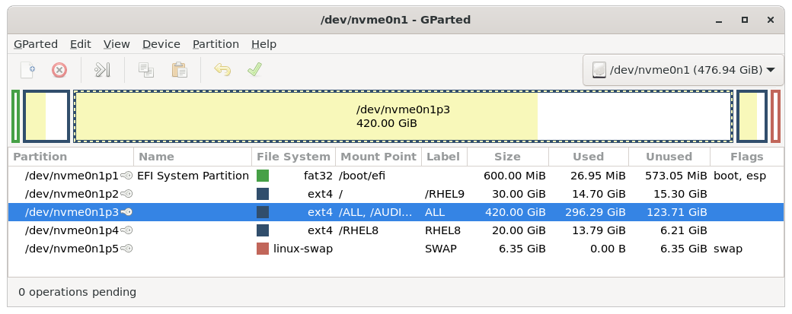
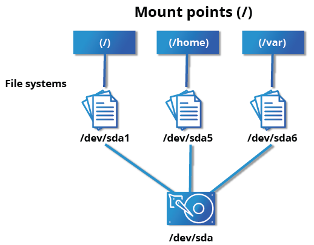
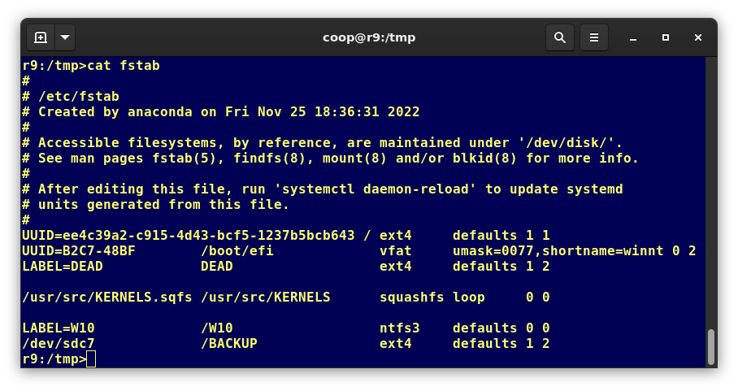
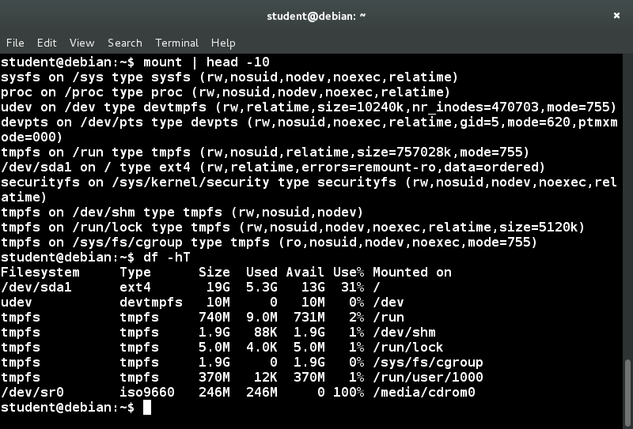

# File Operations

## Introduction to Filesystems
"Everything is a file" is an often repeated adage quoted by users of Linux. Whether you are dealing with normal data files and documents, or with devices such as sound cards and printers, this means interaction with them proceeds through the same Input/Output (I/O) operations you commonly use with files. 

On many systems, the filesystem is structured like a tree. The tree is usually portrayed as inverted and starts at what is most often called the root directory, which marks the beginning of the hierarchical filesystem and is also sometimes referred to as the trunk and simply denoted by /. The root directory is not the same as the root user. The hierarchical filesystem also contains other elements in the path (directory names), which are separated by forward slashes (/), as in /usr/bin/emacs, where the last element is the actual file name.

## Filesystem Varieties
Linux supports a number of native filesystem types, expressly created by Linux developers, such as:
- ext3
- ext4
- squashfs
- btrfs

It also offers implementations of filesystems used on other alien operating systems, such as those from:
- Windows (ntfs, vfat, exfat)
- SGI (xfs)
- IBM (jfs)
- MacOS (hfs, hfs+)

Many older, legacy filesystems, such as FAT, are also supported.

It is often the case that more than one filesystem type is used on a machine, based on considerations such as the size of files, how often they are modified, what kind of hardware they sit on and what kind of access speed is needed, etc. The most advanced filesystem types in common use are the journaling varieties: ext4, xfs, btrfs, and jfs. These have many state-of-the-art features and high performance, and are not easy to corrupt accidentally.

Linux also makes use of network (or distributed) filesystems, where all or part of the filesystem is on external machines.

## Linux Partitions
In most situations, each filesystem on a Linux system occupies a disk partition. Partitions help to organize the contents of disks according to the kind and use of the data contained. For example, important programs required to run the system are often kept on a separate partition (known as root or /) than the one that contains files owned by regular users of that system (/home). In addition, temporary files created and destroyed during the normal operation of Linux may be located on dedicated partitions. One advantage of this kind of isolation by type and variability is that when all available space on a particular partition is exhausted, the system may still operate normally. Furthermore, if data is either corrupted through error or hardware failure, or breached through a security problem, it might be possible to confine problems to an area smaller than the entire system.



## Mount Points
Before you can start using a filesystem, you need to mount it on the filesystem tree at a mount point. This is simply a directory (which may or may not be empty) where the filesystem is to be grafted on. Sometimes, you may need to create the directory if it does not already exist.

If you mount a filesystem on a non-empty directory, the former contents of that directory are covered-up and not accessible until the filesystem is unmounted. Thus, mount points are usually empty directories.



## Mounting and Unmounting
The mount command is used to attach a filesystem (which can be local to the computer or on a network) somewhere within the filesystem tree. The basic arguments are the device node and mount point. For example, `$ sudo mount /dev/sda5 /home` will attach the filesystem contained in the disk partition associated with the /dev/sda5 device node into the filesystem tree at the /home mount point. There are other ways to specify the partition other than the device node, such as using the disk label or UUID (Universally Unique IDentifier).

To unmount the partition, the command would be: `$ sudo umount /home`. Note the command is umount, not unmount! Only a root user (logged in as root, or using sudo) has the privilege to run these commands, unless the system has been otherwise configured.

If you want it to be automatically available every time the system starts up, you need to edit /etc/fstab accordingly (the name is short for filesystem table). Looking at this file will show you the configuration of all pre-configured filesystems. man fstab will display how this file is used and how to configure it.



Executing mount without any arguments will show all presently mounted filesystems.

The command df -Th (disk free) will display information about mounted filesystems, including the filesystem type, and usage statistics about currently used and available space. You may notice a number of entries of type tmpfs. These are not real physical filesystems but are parts of system memory that are represented as such to take advantage of certain programming features.



## NFS and Network Filesystems
It is often necessary to share data across physical systems which may be either in the same location or anywhere that can be reached by the Internet. A network (also sometimes called distributed) filesystem may have all its data on one machine or have it spread out on more than one network node. A variety of different filesystems can be used locally on individual machines; a network filesystem can be thought of as a grouping of lower-level filesystems of varying types.

Many system administrators mount remote home directories on a server in order to give them access to the same files and configuration files across multiple client systems. This allows the users to log in to different computers, yet still have access to the same files and resources.

The most common such filesystem is named simply NFS (the Network Filesystem). It has a very long history and was first developed by Sun Microsystems. Another common implementation is CIFS (also termed SAMBA), which has Microsoft roots. 

### NFS on the Server
On the server machine, NFS uses daemons (built-in networking and service processes in Linux) and other system servers are started at the command line by typing `$ sudo systemctl start nfs`. On some systems, such as RHEL/CentOS, and Fedora, the service is now called nfs-server, not nfs.

The text file /etc/exports contains the directories and permissions that a host is willing to share with other systems over NFS. A very simple entry in this file may look like the following:

```
/projects *.example.com(rw)
```

This entry allows the directory /projects to be mounted using NFS with read and write (rw) permissions and shared with other hosts in the example.com domain. Every file in Linux has three possible permissions: read (r), write (w) and execute (x).

After modifying the /etc/exports file, you can type `exportfs -av` to notify Linux about the directories you are allowing to be remotely mounted using NFS. You can also restart NFS with `sudo systemctl restart nfs`, but this is heavier, as it halts NFS for a short while before starting it up again. To make sure the NFS service starts whenever the system is booted, issue `sudo systemctl enable nfs`.

### NFS on the Client
On the client machine, if it is desired to have the remote filesystem mounted automatically upon system boot, /etc/fstab is modified to accomplish this. For example, an entry in the client's /etc/fstab might look like the following:

```
servername:/projects /mnt/nfs/projects nfs defaults 0 0
```

You can also mount the remote filesystem without a reboot or as a one-time mount by directly using the mount command: `$ sudo mount servername:/projects /mnt/nfs/projects`.

Remember, if /etc/fstab is not modified, this remote mount will not be present the next time the system is restarted. Furthermore, you may want to use the nofail option in fstab in case the NFS server is not live at boot.
