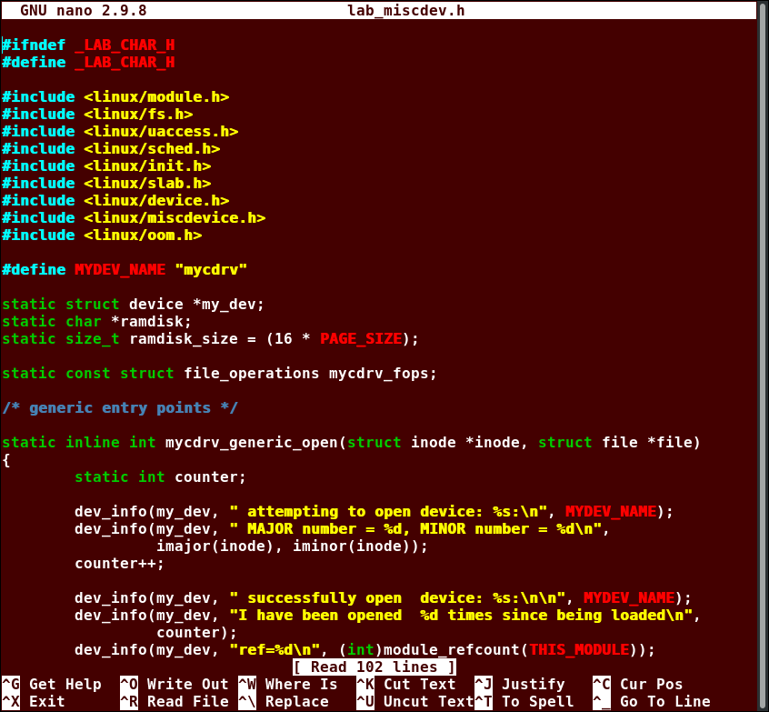
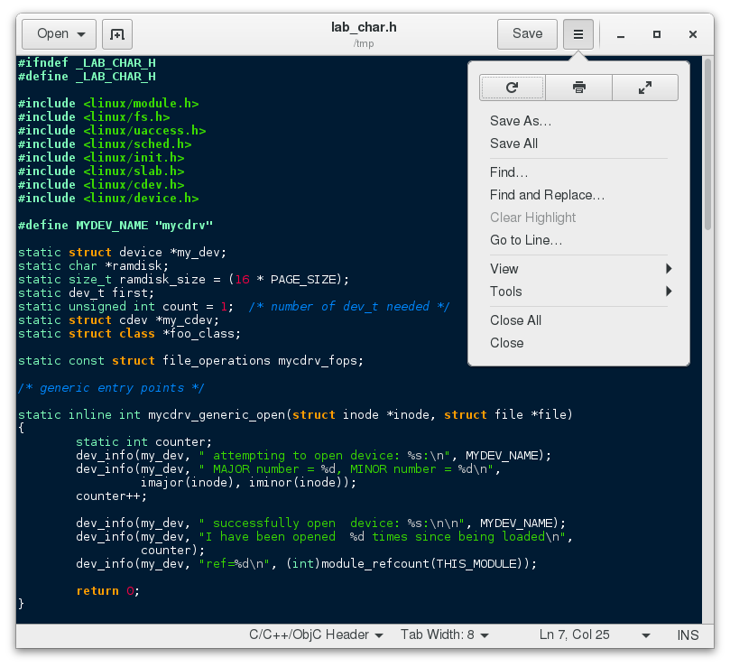
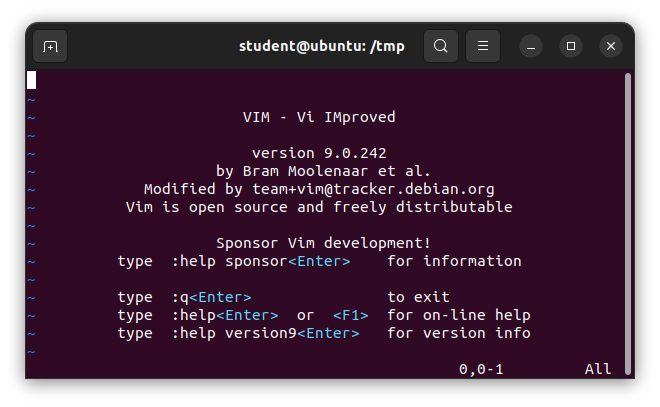
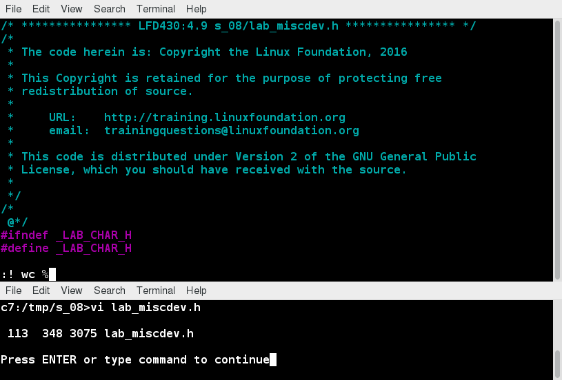
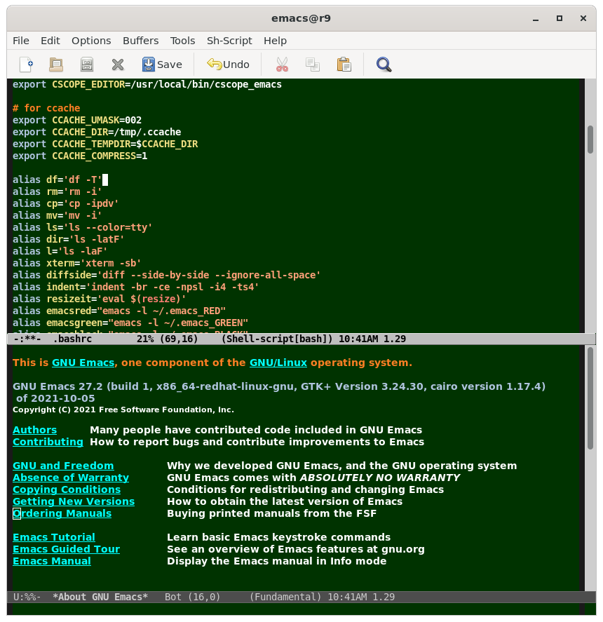

# Text Editors

## Creating Files Without Using an Editor
If you want to create a file without using an editor, there are two standard ways to create one from the command line and fill it with content.

The first is to use `echo` repeatedly:

```
$ echo line one > myfile
$ echo line two >> myfile
$ echo line three >> myfile
```

Note that while a single greater-than sign (`>`) will send the output of a command to a file (and obliterate any already existing version of that file!), two of them (`>>`) will append the new output to an existing file.

The second way is to use `cat` combined with redirection:

```
$ cat << EOF > myfile
> line one
> line two
> line three
> EOF
$
```

In this example, the string used to show the beginning and end of the process need not be `EOF`; it could be `STOP` or any other string not used in the content itself. Both techniques produce a file with the following lines in it:

```
line one
line two
line three
```

## nano
To open a file, type `nano <filename>` and press Enter. If the file does not exist, it will be created.

nano provides a two line shortcut bar at the bottom of the screen that lists the available commands. Some of these commands are:

- CTRL-G: Display the help screen
- CTRL-O: Write to a file
- CTRL-X: Exit a file
- CTRL-R: Insert contents from another file to the current buffer
- CTRL-C: Show cursor position



## gedit
gedit (pronounced 'g-edit') is a simple-to-use graphical editor that can only be run within a Graphical Desktop environment. To open a new file find the program in your desktop's menu system, or from the command line type `gedit <filename>`. If the file does not exist, it will be created.



## vi
Usually, the actual program installed on your system is vim, which stands for Vi IMproved and is aliased to the name vi. The name is pronounced as “vee-eye”. When using vi, all commands are entered through the keyboard. 

Typing `vimtutor` launches a short but very comprehensive tutorial for those who want to learn their first vi commands.



### vi Modes
| Mode | Feature |
| - | - |
| Command | - By default, vi starts in Command mode. <br> - Each key is an editor command. <br> - Keyboard strokes are interpreted as commands that can modify file contents. |
| Insert | - Type `i` to switch to Insert mode from Command mode. <br> - Used to enter (insert) text into a file. <br> - Indicated by an `-- INSERT --` indicator at the bottom of the screen. <br> - Press Esc to exit Insert mode and return to Command mode. |
| Line | - Type `:` to switch to the Line mode from Command mode. <br> - Each key is an external command, including operations such as writing the file contents to disk or exiting. <br> - Press Esc to exit Line mode and return to Command mode. |

### Working with Files in vi
| Command | Usage |
| - | - |
| `vi myfile` | Start the editor and edit `myfile` |
| `vi -r myfile` | Start and edit `myfile` in recovery mode from a system crash |
| `:r file2` | Read in `file2` and insert at current position |
| `:w` | Write to the file |
| `:w myfile` | Write out to `myfile` |
| `:w! file2` | Overwrite `file2` |
| `:x` <br> `:wq` | Exit and write out modified file |
| `:q` | Quit |
| `:q!` | Quit even though modifications have not been saved |

### Changing Cursor Positions in vi
Line mode commands require the ENTER key to be pressed after the command is typed.

| Key | Usage |
| - | - |
| arrow keys | To move up, down, left and right |
| `j` <br> Enter | To move one line down |
| `k` | To move one line up |
| `h` <br> Backspace | To move one character left |
| `l` <br> Space | To move one character right |
| `0` | To move to beginning of line |
| `$` | To move to end of line |
| `w` | To move to beginning of next word |
| `:0` <br> `1G` | To move to beginning of file |
| `:n` <br> `nG` | To move to line `n` |
| `:$` <br> `G` | To move to last line in file |
| CTRL-F <br> Page Down | To move forward one page |
| CTRL-B <br> Page Up | To move backward one page |
| `^l` | To refresh and center screen |

### Searching for Text in vi
| Command | Usage |
| - | - |
| `/pattern` | Search forward for pattern |
| `?pattern` | Search backward for pattern |

| Key | Usage |
| - | - |
| `n` | Move to next occurrence of search pattern |
| `N` | Move to previous occurrence of search pattern |

### Working with Text in vi
| Key | Usage |
| - | - |
| `a` | Append text after cursor; stop upon Escape key |
| `A` | Append text at end of current line; stop upon Escape key |
| `i` | Insert text before cursor; stop upon Escape key |
| `I` | Insert text at beginning of current line; stop upon Escape key |
| `o` | Start a new line below current line, insert text there; stop upon Escape key |
| `O` | Start a new line above current line, insert text there; stop upon Escape key |
| `r` | Replace character at current position |
| `R` | Replace text starting with current position; stop upon Escape key |
| `x` | Delete character at current position |
| `Nx` | Delete N characters, starting at current position |
| `dw` | Delete the word at the current position |
| `D` | Delete the rest of the current line |
| `dd` | Delete the current line |
| `Ndd` <br> `dNd` | Delete N lines |
| `u` | Undo the previous operation |
| `yy` | Yank (copy) the current line and put it in buffer |
| `Nyy` <br> `yNy` | Yank (copy) N lines and put it in buffer |
| `p` | Paste at the current position the yanked line or lines from the buffer |

### Using External Commands in vi
Typing `!` executes a command from within vi. This technique is best suited for non-interactive commands, such as `:! wc %`. Typing this will run the `wc` (word count) command on the file; the character `%` represents the file currently being edited.



## emacs
The emacs editor is a popular competitor for vi. Rather than having different modes for command and insert, like vi, emacs uses the CTRL and Meta (Alt or Esc) keys for special commands.

The emacs tutorial is a good place to start learning basic commands. It is available any time when in emacs by simply typing CTRL-h (for help) and then the letter t for tutorial.



### Working with emacs
| Key | Usage |
| --- | ----- |
| `emacs myfile` | Start emacs and edit `myfile` |
| CTRL-x i | Insert prompted for file at current position |
| CTRL-x s | Save all files |
| CTRL-x CTRL-w | Write to the file giving a new name when prompted |
| CTRL-x CTRL-s | Saves the current file |
| CTRL-x CTRL-c | Exit after being prompted to save any modified files |

### Changing Cursor Positions in emacs
| Key | Usage |
| --- | ----- |
| arrow keys | Use the arrow keys for up, down, left and right |
| CTRL-n | One line down |
| CTRL-p | One line up |
| CTRL-f | One character forward/right |
| CTRL-b | One character back/left |
| CTRL-a | Move to beginning of line |
| CTRL-e | Move to end of line |
| Meta-f | Move to beginning of next word |
| Meta-b | Move back to beginning of preceding word |
| Meta-< | Move to beginning of file |
| Meta-g-g-n | Move to line n (can also use 'Esc-x Goto-line n') |
| Meta-> | Move to end of file |
| CTRL-v <br> Page Down | Move forward one page |
| Meta-v <br> Page Up | Move backward one page |
| CTRL-l | Refresh and center screen |

### Searching for Text in emacs
| Key | Usage |
| --- | ----- |
| CTRL-s | Search forward for prompted pattern, or for next pattern |
| CTRL-r | Search backwards for prompted pattern, or for next pattern |

### Working with Text in emacs
| Key | Usage |
| --- | ----- |
| CTRL-o | Insert a blank line |
| CTRL-d | Delete character at current position |
| CTRL-k | Delete the rest of the current line |
| CTRL-_ | Undo the previous operation |
| CTRL-space <br> CTRL-@ | Mark the beginning of the selected region (the end will be at the cursor position) |
| CTRL-w | Delete the current marked text and write it to the buffer |
| CTRL-y | Insert at current cursor location whatever was most recently deleted |

## vi vs. emacs
Be aware that fights among seasoned users over which editor is better can be quite intense and are often described as a holy war. It is clear, however, that there are many more users of vi than there are of emacs. Both editing programs are here to stay no matter what.
