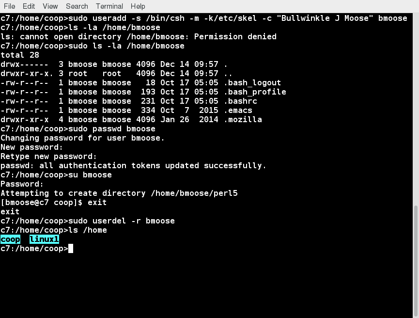
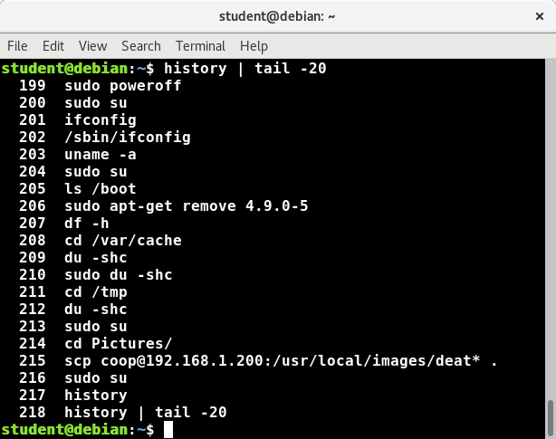
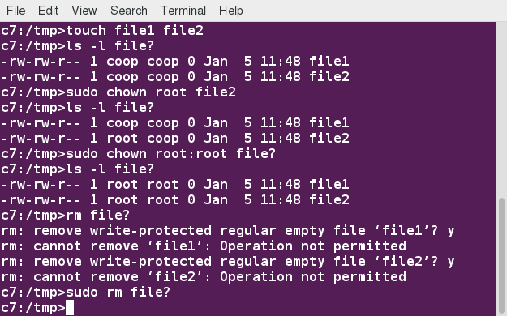

# User Environment

## Identifying the Current User
Linux is a multi-user operating system, meaning more than one user can log on at the same time.
- To identify the current user, type `whoami`
- To list the currently logged-on users, type `who`
- To see more detailed information, type `who -a`

## User Startup Files
In Linux, the command shell program uses one or more startup files to configure the user environment. Files in `/etc` define global settings for all users, while initialization files in the user's home directory can include and/or override the global settings.

The standard prescription is that when you first login to Linux, `/etc/profile` is read and evaluated, after which the following files are searched (if they exist) in the listed order:
1. `~/.bash_profile`
2. `~/.bash_login`
3. `~/.profile`

The Linux login shell evaluates whatever startup file that it comes across first and ignores the rest. This means that if it finds `~/.bash_profile`, it ignores `~/.bash_login` and `~/.profile`. Different distributions may use different startup files.

However, every time you create a new shell, or terminal window, etc., you do not perform a full system login; only a file named `~/.bashrc` file is read and evaluated. Although this file is not read and evaluated along with the login shell, most distributions and/or users include the `~/.bashrc` file from within one of the three user-owned startup files.

Most commonly, users only fiddle with `~/.bashrc`, as it is invoked every time a new command line shell initiates, or another program is launched from a terminal window, while the other files are read and executed only when the user first logs onto the system.

Recent distributions sometimes do not even have `~/.bash_profile` and/or `~/.bash_login`, and some just do little more than include `~/.bashrc`.

## Creating Aliases
You can create customized commands or modify the behavior of already existing ones by creating aliases. Most often, these aliases are placed in your `~/.bashrc` file so they are available to any command shells you create.

`alias` lists currently defined aliases. `unalias` removes an alias. 


## Basics of Users and Groups
All Linux users are assigned a unique user ID (`uid`), which is just an integer; normal users start with a `uid` of 1000 or greater.

Linux uses groups for organizing users. Groups are collections of accounts with certain shared permissions; they are used to establish a set of users who have common interests for the purposes of access rights, privileges, and security considerations. Access rights to files (and devices) are granted on the basis of the user and the group they belong to.

Control of group membership is administered through the `/etc/group` file, which shows the list of groups and their members. By default, every user belongs to a default (primary) group. When a user logs in, the group membership is set for their primary group, and all the members enjoy the same level of access and privilege. Permissions on various files and directories can be modified at the group level.

Users also have one or more group IDs (`gid`), including a default one that is the same as the user ID. These numbers are associated with names through the files `/etc/passwd` and `/etc/group`. 

For example, `/etc/passwd` might contain `john:x:1002:1002:John Garfield:/home/john:/bin/bash`, and `/etc/group` might contain `john:x:1002`.

### Adding and Removing Users
Adding a new user is done with `useradd` and removing an existing user is done with `userdel`. In the simplest form, an account for the new user `bjmoose` would be done with `$ sudo useradd bjmoose`, which, by default, sets the home directory to `/home/bjmoose`, populates it with some basic files from /`etc/skel` and adds a line to `/etc/passwd` such as `bjmoose:x:1002:1002::/home/bjmoose:/bin/bash` and sets the default shell to `/bin/bash`.

Removing a user account is as easy as typing `userdel bjmoose`. However, this will leave the `/home/bjmoose` directory intact. This might be useful if it is a temporary inactivation. To remove the home directory while removing the account one needs to use the `-r` option.

Typing `id` with no argument gives information about the current user, as in:

```
$ id
uid=1002(bjmoose) gid=1002(bjmoose) groups=106(fuse),1002(bjmoose)
```

If given the name of another user as an argument, `id` will report information about that other user.



### Adding and Removing Groups
Adding a new group is done with `groupadd`: `$ sudo /usr/sbin/groupadd anewgroup`.

The group can be removed with: `$ sudo /usr/sbin/groupdel anewgroup`.

Adding a user to an already existing group is done with `usermod`. For example, you would first look at what groups the user already belongs to:

```
$ groups rjsquirrel
rjsquirrel : rjsquirrel
```

and then add the new group:

```
$ sudo /usr/sbin/usermod -a -G anewgroup rjsquirrel

$ groups rjsquirrel
rjsquirrel: rjsquirrel anewgroup
```

These utilities update `/etc/group` as necessary. Make sure to use the `-a` option, for append, so as to avoid removing already existing groups. `groupmod` can be used to change group properties, such as the Group ID (`gid`) with the `-g` option or its name with then `-n` option.

Removing a user from the group is somewhat trickier. The `-G` option to usermod must give a complete list of groups. Thus, if you do:

```
$ sudo /usr/sbin/usermod -G rjsquirrel rjsquirrel

$ groups rjsquirrel
rjsquirrel : rjsquirrel
```

only the `rjsquirrel` group will be left.

## `su` and `sudo`
When assigning elevated privileges, you can use the command `su` (switch or substitute user) to launch a new shell running as another user (you must type the password of the user you are becoming). Most often, this other user is `root`, and the new shell allows the use of elevated privileges until it is exited. It is almost always a bad (dangerous for both security and stability) practice to use `su` to become root. Resulting errors can include deletion of vital files from the system and security breaches.

Granting privileges using `sudo` is less dangerous and is preferred. By default, `sudo` must be enabled on a per-user basis. However, some distributions enable it by default for at least one main user, or give this as an installation option.

## The `root` Account
The `root` account is very powerful and has full access to the system. Other operating systems often call this the administrator account; in Linux, it is often called the superuser account.

To temporarily become the superuser for a series of commands, you can type `su` and then be prompted for the root password.

To execute just one command with root privilege type `sudo <command>`. When the command is complete, you will return to being a normal unprivileged user.

`sudo` configuration files are stored in the `/etc/sudoers` file and in the `/etc/sudoers.d/` directory. By default, the `sudoers.d` directory is empty.

## Environment Variables
An environment variable is actually just a character string that contains information used by the command shell and other applications. There are a number of ways to view the values of currently set environment variables; one can type `set`, `env`, or `export`. Depending on the state of your system, `set` may print out many more lines than the other two methods.


### Setting Environment Variables
By default, variables created within a script are only available to the current shell; child processes (sub-shells) will not have access to values that have been set or modified. Allowing child processes to see the values requires use of the `export` command.

| Task | Command |
| - | - |
| Show the value of a specific variable | `echo $SHELL` |
| Export a new variable value | `export VARIABLE=value` |
| Add a variable permanently | 1. Add the line `export VARIABLE=value` to `~/.bashrc` <br> 2. Type `source ~/.bashrc` or `. ~/.bashrc` |

You can also set environment variables to be fed as a one shot to a command as in:

```
$ SDIRS="s_0*" KROOT=/lib/modules/$(uname -r)/build make modules_install
```

which feeds the values of the `SDIRS` and `KROOT` environment variables to the command `make modules_install`.

### The `HOME` Variable
`HOME` is an environment variable that represents the home directory of the user. `cd` without arguments will change the current working directory to the value of `HOME`. Also, the tilde character (`~`) is often used as an abbreviation for `$HOME`.

### The `PATH` Variable
`PATH` is an ordered list of directories which is scanned when a command is given to find the appropriate program or script to run. Each directory in the path is separated by colons (`:`). 

A null (empty) directory name (or `./`) indicates the current directory at any given time.
- `:path1:path2`
- `path1::path2`

In the first example, there is a null directory before the first colon. Similarly, there is a null directory between `path1` and `path2` in the next example.

To prefix a private `bin` directory to your path:

```
$ export PATH=$HOME/bin:$PATH
$ echo $PATH
/home/student/bin:/usr/local/bin:/usr/bin:/bin/usr
```

### The `SHELL` Variable
The environment variable `SHELL` points to the full pathname of user's default command shell:

```
$ echo $SHELL
/bin/bash
```

### The `PS1` Variable
Prompt Statement (PS) is used to customize your prompt string in your terminal windows to display the information you want. `PS1` is the primary prompt variable which controls what your command line prompt looks like.

The following special characters can be included in `PS1`:
- `\u` - User name
- `\h` - Host name
- `\w` - Current working directory
- `\!` - History number of this command
- `\d` - Date

They must be surrounded in single quotes when they are used, as in the following example:

```
$ echo $PS1
$
$ export PS1='\u@\h:\w$ '
student@example.com:~$
```

A good practice is to save the old prompt first and then restore,  change it back:

```
$ OLD_PS1=$PS1
$ PS1=$OLD_PS1
```

## Recalling Previous Commands
bash keeps track of previously entered commands and statements in a history buffer. To view the list of previously executed commands, you can just type `history` at the command line.

The list of commands is displayed with the most recent command appearing last in the list. This information is stored in `~/.bash_history`. If you have multiple terminals open, the commands typed in each session are not saved until the session terminates.



### Using History Environment Variables
- `HISTFILE`: The location of the history file.
- `HISTFILESIZE`: The maximum number of lines in the history file (default 500).
- `HISTSIZE`: The maximum number of commands in the history file.
- `HISTCONTROL`: How commands are stored.
- `HISTIGNORE`: Which command lines can be unsaved.

### Finding and Using Previous Commands
| Key | Usage |
| - | - |
| Up/Down arrow keys | Browse through previously executed commands |
| `!!` ("bang-bang") | Execute the previous command |
| CTRL-R | Search and use the most recently used command that matches |

### Executing Previous Commands
| Syntax | Task |
| - | - |
| `!` | Start a history substitution |
| `!$` | Refer to the last argument in a line |
| `!n` | Refer to the nth command line |
| `!string` | Refer to the most recent command starting with string |

```
$ history
  1. echo $SHELL
  2. echo $HOME
  3. echo $PS1
  4. ls -a
  5. ls -l /etc/ passwd
  6. sleep 1000
  7. history

$ !1          # Execute command #1 above
echo $SHELL
/bin/bash

$ !sl         # Execute the command beginning with "sl"
sleep 1000
```

### Keyboard Shortcuts
| Shortcut | Task |
| - | - |
| CTRL-L | Clears the screen |
| CTRL-S | Temporarily halt output to the terminal window |
| CTRL-Q | Resume output to the terminal window |
| CTRL-D | Exits the current shell |
| CTRL-Z | Puts the current process into suspended background |
| CTRL-C | Kills the current process |
| CTRL-H | Backspace |
| CTRL-A | Goes to the beginning of the line |
| CTRL-W | Deletes the word before the cursor |
| CTRL-U | Deletes from beginning of line to cursor position |
| CTRL-E | Goes to the end of the line |
| Tab | Auto-completes files, directories, and binaries |

## File Ownership
In Linux and other UNIX-based operating systems, every file is associated with a user who is the owner. Every file is also associated with a group which has an interest in the file and certain rights, or permissions: read, write, and execute.

| Command | Usage |
| - | - |
| `chown`	| Used to change user ownership of a file or directory |
| `chgrp`	| Used to change group ownership |
| `chmod`	| Used to change the permissions on the file, which can be done separately for owner, group and the rest of the world (often named as `other`) |

### Example of `chown`

First, we create two empty files using `touch`. 

Notice it requires `sudo` to change the owner of `file2` to root. The second chown command changes both owner and group at the same time!

Finally, only the superuser can remove the files. 



### Example of `chgrp`


### File Permission Modes and `chmod`
Files have three kinds of permissions: read (`r`), write (`w`), execute (`x`). These permissions affect three groups of owners: user/owner (`u`), group (`g`), and others (`o`):

```
rwx: rwx: rwx
 u:   g:   o
```

For instance, to give the owner and others execute permission and remove the group write permission:

```
$ ls -l somefile
-rw-rw-r-- 1 student student 1601 Mar 9 15:04 somefile
$ chmod uo+x,g-w somefile
$ ls -l somefile
-rwxr--r-x 1 student student 1601 Mar 9 15:04 somefile
```

This kind of syntax can be difficult to type and remember, so one often uses a shorthand which lets you set all the permissions in one step. This is done with a simple algorithm, and a single digit suffices to specify all three permission bits for each entity. This digit is the sum of:
- 4 if read permission is desired
- 2 if write permission is desired
- 1 if execute permission is desired

Thus, 7 means read/write/execute, 6 means read/write, 5 means read/execute, and 3 means write/execute.

When you apply this to the chmod command, you have to give three digits for each degree of freedom, such as in: `$ chmod 755 somefile`.
