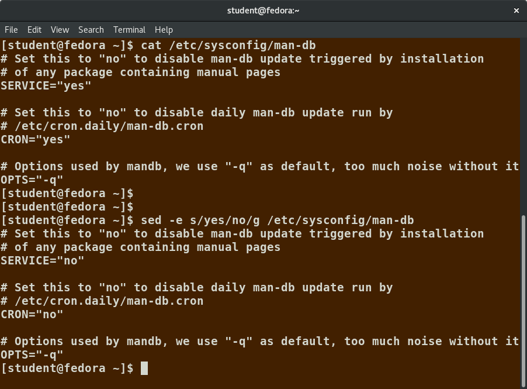
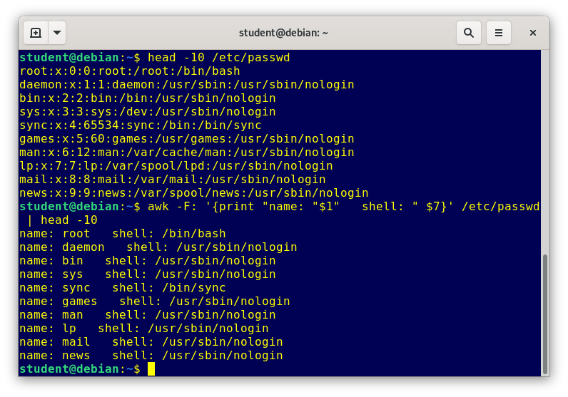
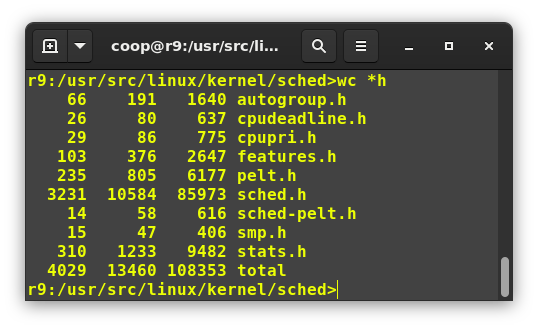

# Manipulating Text

## `cat`
`cat` is short for concatenate and is one of the most frequently used Linux command line utilities. It is often used to read and print files, as well as for simply viewing file contents. To view a file, use `$ cat <filename>`.

| Command | Usage |
| - | - |
| `cat file1 file2` | Concatenate multiple files and display the output |
| `cat file1 file2 > newfile` | Combine multiple files and save the output into a new file |
| `cat file >> existingfile` | Append a file to the end of an existing file |
| `cat > file` | Any subsequent lines typed will go into the file until CTRL-D is typed |
| `cat >> file` | Any subsequent lines are appended to the file until CTRL-D is typed |

The `tac` command (`cat` spelled backwards) prints the lines of a file in reverse order. Each line remains the same, but the order of lines is inverted.

## `echo`
`echo` simply displays text: `$ echo string`. 

The `–e` option, along with the following switches, is used to enable special character sequences, such as the newline character or horizontal tab:
- `\n` represents newline
- `\t` represents horizontal tab

| Command | Usage |
| - | - |
| `echo string > newfile` | The specified string is placed in a new file |
| `echo string >> existingfile` | The specified string is appended to the end of an already existing file |
| `echo $variable` | The contents of the specified environment variable are displayed |

## `less`
System administrators need to work with configuration files, text files, documentation files, and log files. Some of these files may be large or become quite large as they accumulate data with time. In such cases, directly opening the file in an editor will probably be inefficient because most text editors usually try to read the whole file into memory first. Instead, one can use `less` to view the contents of such a large file, scrolling up and down page by page, without the system having to place the entire file in memory before starting. For example, viewing `somefile` can be done by `$ less somefile`.

By default, man pages are sent through the `less` command. You may have encountered the older, `more` utility, which has the same basic function but fewer capabilities: i.e., less is more!

## `head`
`head` reads the first few lines of each file (10 by default) and displays it on standard output. 

For example, if you want to print the first 5 lines from `/etc/default/grub`, use the following commands:

```
$ head –n 5 /etc/default/grub
$ head -5 /etc/default/grub
```

## `tail`
`tail` prints the last few lines of each file and displays it on standard output. By default, it displays the last 10 lines. 

For example, to display the last 15 lines of `somefile.log`, use the following commands:

```
$ tail -n 15 somefile.log
$ tail -15 somefile.log
```

To continually monitor new output in a growing log file: `$ tail -f somefile.log`. This command will continuously display any new lines of output in `somefile.log` as soon as they appear.

## Regular Expressions
Regular expressions are text strings used for matching a specific pattern, or to search for a specific location, such as the start or end of a line or a word. Regular expressions can contain both normal characters or so-called meta-characters, such as `*` and `$`.

| Search Patterns | Usage |
| - | - |
| `.(dot)` | Match any single character |
| `a\|z` | Match `a` or `z` |
| `$` | Match end of a line |
| `^` | Match beginning of a line |
| `*` | Match preceding item 0 or more times |

Consider the following sentence: `the quick brown fox jumped over the lazy dog`.

| Command | Result |
| - | - |
| `a..` | `azy` |
| `b.\|j.` | `br` and `ju` |
| `..$` | `og` |
| `l.*` | `lazy dog` |
| `l.*y` | `lazy` |
| `the.*` | `the quick brown fox jumped over the lazy dog` |

## `sed`
`sed` is a powerful text processing tool and is one of the oldest, earliest and most popular UNIX utilities. Its name is an abbreviation for stream editor. Data from an input source/file (or stream) is taken and moved to a working space. The entire list of operations/modifications is applied over the data in the working space and the final contents are moved to the standard output space (or stream).

| Command | Usage |
| - | - |
| `sed -e command file` | Specify editing commands at the command line, process input from a file, and put the output on standard output |
| `sed -f scriptfile filename` | Specify a script file containing `sed` commands, operate on file, and put output on standard out |
| `echo "I hate you" \| sed s/hate/love/` | Filter standard input and put output on standard out |

| Command | Usage |
| - | - |
| `sed s/pattern/replace_string/ file` | Substitute first string occurrence in every line |
| `sed s/pattern/replace_string/g file` | Substitute all string occurrences in every line |
| `sed 1,3s/pattern/replace_string/g file` | Substitute all string occurrences in a range of lines |
| `sed -i s/pattern/replace_string/g file` | Save changes for string substitution in the same file |



## `awk`
`awk` is used to extract and then print specific contents of a file and is often used to construct reports. It was created at Bell Labs in the 1970s and derived its name from the last names of its authors: Alfred Aho, Peter Weinberger, and Brian Kernighan.

The input file is read one line at a time, and, for each line, `awk` matches the given pattern in the given order and performs the requested action. The `-F` option allows you to specify a particular field separator character.

The command/action in `awk` needs to be surrounded with apostrophes (or single-quote (`'`)):

| Command | Usage |
| - | - |
| `awk 'command' file` | Specify a command directly at the command line |
| `awk -f scriptfile file` | Specify a file that contains the script to be executed |
| `awk '{ print $0 }' /etc/passwd` | Print entire file |
| `awk -F: '{ print $1 }' /etc/passwd` | Print first field (column) of every line, separated by a colon |
| `awk -F: '{ print $1 $7 }' /etc/passwd` | Print first and seventh field of every line |



## `sort` and `uniq`
`sort` is used to rearrange the lines of a text file, in either ascending or descending order according to a sort key. The default sort key is the order of the ASCII characters.

| Syntax | Usage |
| - | - |
| `sort <filename>` | Sort the lines in the specified file, according to the characters at the beginning of each line |
| `cat file1 file2 \| sort` | Combine the two files, then sort the lines and display the output on the terminal |
| `sort -r <filename>` | Sort the lines in reverse order |

`uniq` removes duplicate consecutive lines in a text file and is useful for simplifying the text display. Because `uniq` requires that the duplicate entries must be consecutive, one often runs sort first and then pipes the output into `uniq`; if sort is used with the `-u` option, it can do all this in one step.

To remove duplicate entries from multiple files at once, use `$ sort file1 file2 | uniq > file3` or `$ sort -u file1 file2 > file3`.

To count the number of duplicate entries, use `$ uniq -c filename`.

## `paste`
Suppose you have a file that contains the full name of all employees and another file that lists their phone numbers and Employee IDs. You want to create a new file that contains all the data listed in three columns: name, employee ID, and phone number. `paste` can be used to create a single file containing all three columns. The different columns are identified based on delimiters. 

`paste` accepts the following options:
- `-d` delimiters specify a list of delimiters to be used instead of tabs for separating consecutive values on a single line. Each delimiter is used in turn; when the list has been exhausted, paste begins again at the first delimiter.
- `-s` causes paste to append the data in series rather than in parallel; that is, in a horizontal rather than vertical fashion.

To paste contents from three files: `$ paste file1 file2 file3`.

## `join`
Suppose you have two files with some similar columns. You have saved employees' phone numbers in two files, one with their first name and the other with their last name. You want to combine the files without repeating the data of common columns.

To combine two files on a common field, enter `$ join file1 file2`.

## `split`
`split` is used to break up a file into equal-sized segments for easier viewing and manipulation, and is generally used only on relatively large files. By default, `split` breaks up a file into 1000-line segments. The original file remains unchanged, and a set of new files with the same name plus an added prefix is created. By default, the `x` prefix is added. 

To split a file into segments, use the command `$ split infile`. 

To split a file into segments using a different prefix, use the command `$ split infile <Prefix>`.

## `grep`
`grep` is extensively used as a primary text searching tool. It scans files for specified patterns and can be used with regular expressions, as well as simple strings:

| Command | Usage |
| - | - |
| `grep [pattern] <filename>` | Search for a pattern in a file and print all matching lines |
| `grep -v [pattern] <filename>` | Print all lines that do not match the pattern |
| `grep [0-9] <filename>` | Print the lines that contain the numbers 0 through 9 |
| `grep -C 3 [pattern] <filename>` | Print context of lines (specified number of lines above and below the pattern) for matching the pattern |

## `strings`
`strings` is used to extract all printable character strings found in the files. It is useful in locating human-readable content embedded in binary files; for text files one can just use `grep`.

For example, to search for the string my_string in a spreadsheet: `$ strings book1.xls | grep my_string`.

## `tr`
The `tr` utility is used to translate specified characters into other characters or to delete them. The general syntax is as follows:

```
$ tr [options] set1 [set2]
```

The items in the square brackets are optional. `tr` requires at least one argument and accepts a maximum of two. The first, designated `set1` in the example, lists the characters in the text to be replaced or removed. The second, `set2`, lists the characters that are to be substituted for the characters listed in the first argument. Sometimes these sets need to be surrounded by apostrophes (or single-quotes (`'`)) in order to have the shell ignore that they mean something special to the shell. It is usually safe to use the single-quotes around each of the sets.

For example, suppose you have a file named `city` containing several lines of text in mixed case. To translate all lower case characters to upper case, type `$ cat city | tr a-z A-Z`.

| Command | Usage |
| - | - |
| `tr abcdefghijklmnopqrstuvwxyz ABCDEFGHIJKLMNOPQRSTUVWXYZ` | Convert lower case to upper case |
| `tr '{}' '()' < inputfile > outputfile` | Translate braces into parenthesis |
| `echo "This is for testing" \| tr [:space:] '\t'` | Translate white-space to tabs |
| `echo "This&nbsp;&nbsp;&nbsp;is&nbsp;&nbsp;&nbsp;for&emsp;testing" \| tr -s [:space:]` | Squeeze repetition of characters using `-s` |
| `echo "the geek stuff" \| tr -d 't'` | Delete specified characters using `-d` option |
| `echo "my username is 432234" \| tr -cd [:digit:]` | Complement the sets using `-c` option |
| `tr -cd [:print:] < file.txt` | Remove all non-printable character from a file |
| `tr -s '\n' ' ' < file.txt` | Join all the lines in a file into a single line |

## `tee`
`tee` takes the output from any command, and, while sending it to standard output, it also saves it to a file. For example, to list the contents of a directory on the screen and save the output to a file, type `$ ls -l | tee newfile`.

## `wc`
`wc` (word count) counts the number of lines, words, and characters in a file or list of files. 

| Option | Description |
| - | - |
| `–l` | Displays the number of lines |
| `-c` | Displays the number of bytes |
| `-w` | Displays the number of words |



## `cut`
`cut` is used for manipulating column-based files and is designed to extract specific columns. The default column separator is the TAB character. A different delimiter can be given as a command option. For example, to display the third column delimited by a blank space, enter `$ ls -l | cut -d " " -f3`.

## Viewing Compressed Files
For many commonly-used file and text manipulation programs, there is also a version especially designed to work directly with compressed files.

| Command | Description |
| - | - |
| `zcat compressed-file.txt.gz` | To view a compressed file |
| `zless somefile.gz` <br> `zmore somefile.gz` | To page through a compressed file |
| `zgrep -i less somefile.gz` | To search inside a compressed file |
| `zdiff file1.txt.gz file2.txt.gz` | To compare two compressed files |

There are also equivalent utility programs for other compression methods besides `gzip`; we have `xzcat`, `xzless`, and `xzdiff` associated with `xz` and `bzcat`, `bzless` and `bzdiff` associated with `bzip2`.

