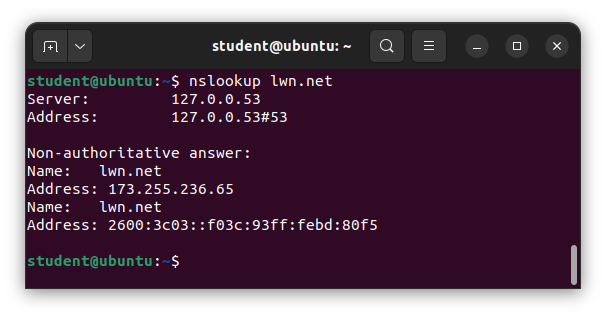
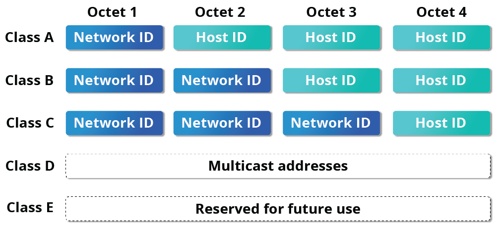
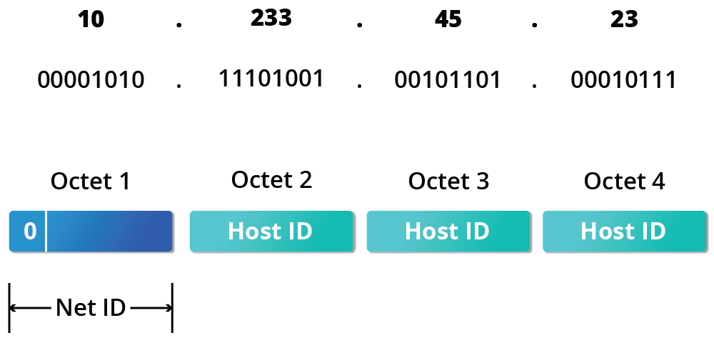
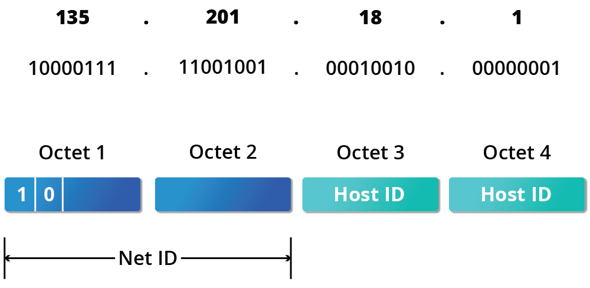
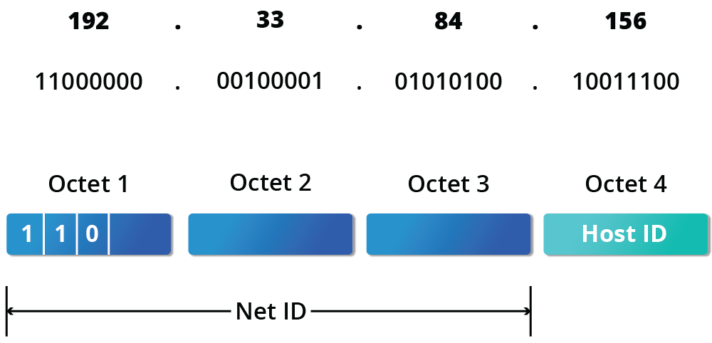
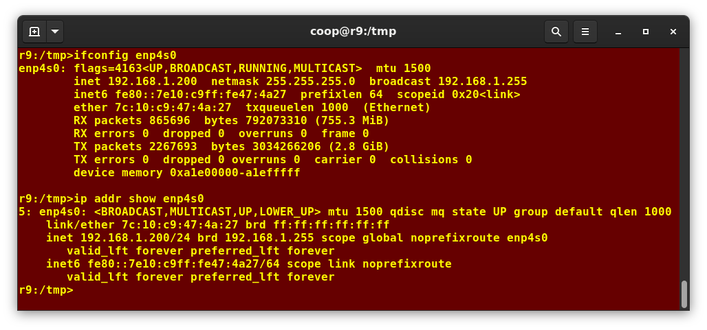
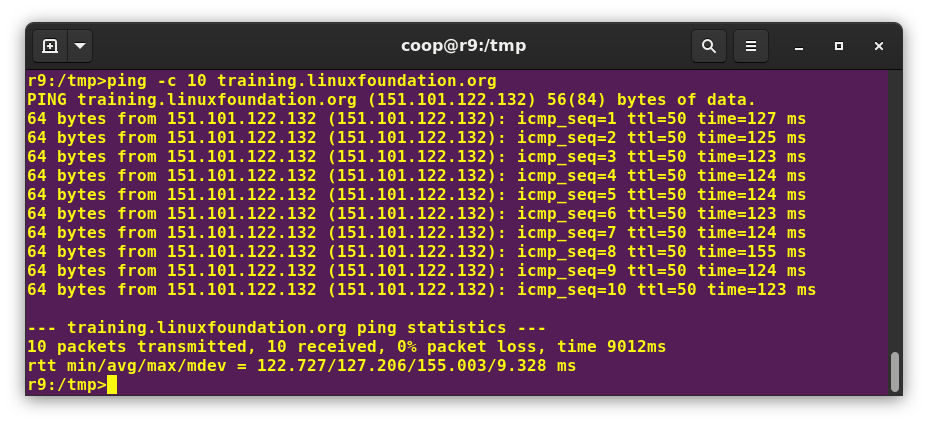
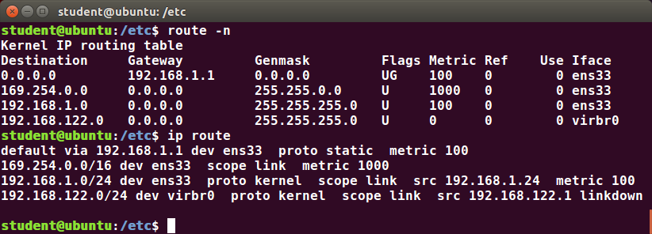
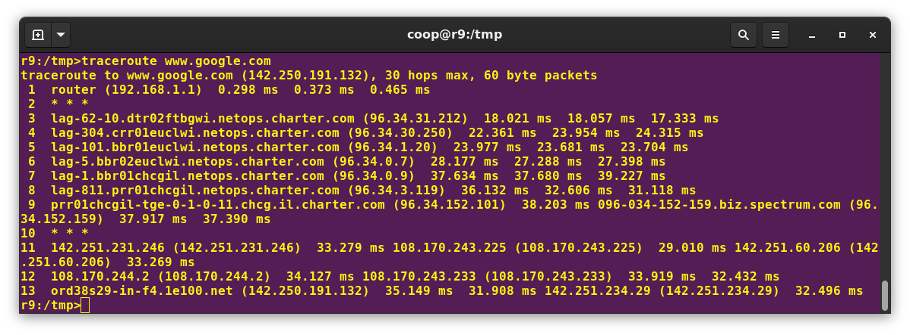
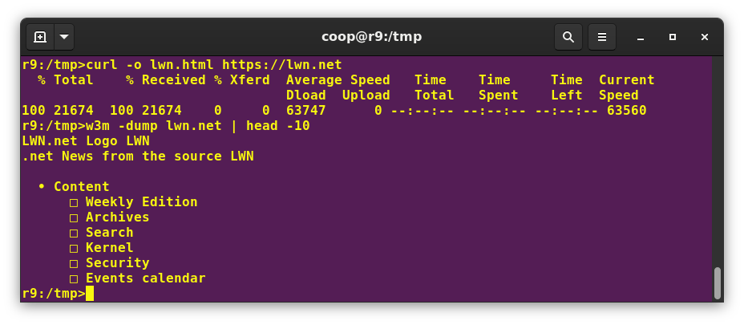

# Network Operations

A network is a group of computers and computing devices connected together through communication channels, such as cables or wireless media. The connected devices are often termed nodes.

Most organizations have both an internal network and an Internet connection for users to communicate with machines and people outside the organization. The Internet is the largest network in the world and can be called "the network of networks".

## IP Addresses
Devices attached to a network must have at least one unique network address identifier known as the IP (Internet Protocol) address. This address is essential for routing packets of information through the network.

Exchanging information across the network requires using streams of small packets, each of which contains a piece of the information going from one machine to another. These packets contain data buffers, together with headers which contain information about where the packet is going to and coming from and where it fits in the sequence of packets that constitute the stream. 

### Address Allocation
Typically, a range of IP addresses are requested from your Internet Service Provider (ISP) by your organization's network administrator. Often, your choice of which class of IP address you are given depends on the size of your network and expected growth needs. If NAT is in operation, such as in a home network, you only get one externally visible address!

You can assign IP addresses to computers over a network either manually or dynamically. Manual assignment adds static (never changing) addresses to the network. Dynamically assigned addresses can change every time you reboot or even more often; the Dynamic Host Configuration Protocol (DHCP) is used to assign IP addresses.

### Name Resolution
Name Resolution is used to convert numerical IP address values into a human-readable format known as the hostname. 

The special hostname localhost is associated with the IP address 127.0.0.1 and describes the machine you are currently on (which normally has additional network-related IP addresses).

### IPv4 and IPv6
There are two different types of IP addresses available: IPv4 (version 4) and IPv6 (version 6). IPv4 is older and by far the more widely used, while IPv6 is newer and is designed to get past limitations inherent in the older standard and furnish many more possible addresses.

IPv4 uses 32-bits for addresses; there are only 4.3 billion unique addresses available. Furthermore, many addresses are allotted and reserved, but not actually used. IPv4 is considered inadequate for meeting future needs because the number of devices available on the global network has increased enormously in recent years.

IPv6 uses 128-bits for addresses; this allows for $3.4 * 10^{38}$ unique addresses. If you have a larger network of computers and want to add more, you might want to move to IPv6 because it provides more unique addresses. However, it can be complex to migrate to IPv6; the two protocols do not always inter-operate well. Thus, moving equipment and addresses to IPv6 requires significant effort and has not been quite as fast as was originally intended. 

One reason IPv4 has not disappeared is there are widely-used ways to effectively make many more addresses available by methods such as NAT (Network Address Translation).  NAT enables sharing one IP address among many locally connected computers, each of which has a unique address only seen on the local network. While this is used in organizational settings, it is also used in simple home networks. For example, if you have a router hooked up to your Internet Provider (such as a cable system) it gives you one externally visible address, but issues each device in your home an individual local address, which is invisible to the outside world.

## Decoding IPv4 Addresses
A 32-bit IPv4 address is divided into four 8-bit sections called octets. Note that octet is just another word for byte:

| IP Address | Bit Format |
| - | - |
| 172.16.31.46 | 10101100.00010000.00011111.00101110 |

Network addresses are divided into five classes: A, B, C, D and E. Classes A, B and C are classified into two parts: Network addresses (Net ID) and Host address (Host ID). The Net ID is used to identify the network, while the Host ID is used to identify a host in the network. Class D is used for special multicast applications (information is broadcast to multiple computers simultaneously) and Class E is reserved for future use. 

### Class A
Class A addresses use the first octet of an IP address as their Net ID and use the other three octets as the Host ID. The first bit of the first octet is always set to zero. So you can use only 7-bits for unique network numbers. As a result, there are a maximum of 126 Class A networks available (the addresses 0000000 and 1111111 are reserved). Not surprisingly, this was only feasible when there were very few unique networks with large numbers of hosts.

Each Class A network can have up to 16.7 million unique hosts on its network. The range of host addresses is from 1.0.0.0 to 127.255.255.255.

### Class B
Class B addresses use the first two octets of the IP address as their Net ID and the last two octets as the Host ID. The first two bits of the first octet are always set to binary 10, so there are a maximum of 16,384 (14-bits) Class B networks. The first octet of a Class B address has values from 128 to 191. The introduction of Class B networks expanded the number of networks but it soon became clear that a further level would be needed.

Each Class B network can support a maximum of 65,536 unique hosts on its network. The range of host addresses is from 128.0.0.0 to 191.255.255.255.

### Class C
Class C addresses use the first three octets of the IP address as their Net ID and the last octet as their Host ID. The first three bits of the first octet are set to binary 110, so almost 2.1 million (21-bits) Class C networks are available. The first octet of a Class C address has values from 192 to 223. These are most common for smaller networks which don't have many unique hosts.

Each Class C network can support up to 256 (8-bits) unique hosts. The range of host addresses is from 192.0.0.0 to 223.255.255.255.

## Network Interfaces
Network interfaces are a connection channel between a device and a network. Physically, network interfaces can proceed through a network interface card (NIC) or can be more abstractly implemented as software. You can have multiple network interfaces operating at once. Specific interfaces can be activated or deactivated at any time.

Information about a particular network interface or all network interfaces can be reported by the `ip` and `ifconfig` utilities, which you may have to run as the superuser, or at least, give the full path, i.e. `/sbin/ifconfig`, on some distributions. `ip` is newer than `ifconfig` and has far more capabilities, but its output is uglier to the human eye.

## Network Configuration Files
Network configuration files are essential to ensure that interfaces function correctly. They are located in the `/etc` directory tree. However, the exact files used have historically been dependent on the particular Linux distribution and version being used. For Debian family configurations, the basic network configuration files could be found under `/etc/network/`, while for Red Hat and SUSE family systems one needed to inspect `/etc/sysconfig/network`.

Modern systems emphasize the use of Network Manager. While the graphical versions of Network Manager do look somewhat different in different distributions, the `nmtui` utility (shown in the screenshot) varies almost not at all, as does the even more sparse `nmcli` (command line interface) utility. 

Recent Ubuntu distributions include `netplan`, which is turned on by default, and supplants Network Manager. However, no other distribution has shown interest.

## `ip`
To view the IP address: `$ /sbin/ip addr show`.

To view the routing information: `$ /sbin/ip route show`.

## `ping`
`ping` is used to check whether or not a machine attached to the network can receive and send data; i.e. it confirms that the remote host is online and is responding.

To check the status of the remote host, at the command prompt, type `ping <hostname>`.

`ping` is frequently used for network testing and management; however, its usage can increase network load unacceptably. Hence, you can abort the execution of `ping` by typing CTRL-C, or by using the `-c` option, which limits the number of packets that `ping` will send before it quits. Some hosts refuse to answer ping requests.

## `route`
A network requires the connection of many nodes. Data moves from source to destination by passing through a series of routers and potentially across multiple networks. Servers maintain routing tables containing the addresses of each node in the network. The IP routing protocols enable routers to build up a forwarding table that correlates final destinations with the next hop addresses.

One can use the `route` utility (or the newer `ip route` command) to view or change the IP routing table to add, delete, or modify specific (static) routes to specific hosts or networks.

| Task | Command | 
| - | - |
| Show current routing table | `route –n`   `ip route` |
| Add static route | `route add -net address`   `ip route add` | 
| Delete static route | `route del -net address`   `ip route del` |

## `traceroute`
`traceroute` is used to inspect the route which the data packet takes to reach the destination host, which makes it quite useful for troubleshooting network delays and errors.

To print the route taken by the packet to reach the network host, at the command prompt, type `traceroute <address>`.

## More Networking Tools
| Tools | Description |
| - | - |
| `ethtool` | Queries network interfaces and can also set various parameters such as the speed |
| `netstat` | Displays all active connections and routing tables; useful for monitoring performance and troubleshooting |
| `nmap` | Scans open ports on a network; important for security analysis |
| `tcpdump` | Dumps network traffic for analysis |
| `iptraf` | Monitors network traffic in text mode |
| `mtr` | Combines functionality of `ping` and `traceroute` and gives a continuously updated display |
| `dig` | Tests DNS workings; a good replacement for `host` and `nslookup` |

## `wget`
`wget` is a command line utility that can capably handle the following types of downloads:
- Large file downloads
- Recursive downloads, where a web page refers to other web pages and all are downloaded at once
- Password-required downloads
- Multiple file downloads

## `curl`
Besides downloading, you may want to obtain information about a URL. `curl` can be used from the command line or a script to read such information. `curl` also allows you to save the contents of a web page to a file, as does `wget`.

You can read a URL using `curl <URL>`. To get the contents of a web page and store it to a file called `saved.html`, type `curl -o saved.html <URL>`.

## FTP (File Transfer Protocol)
When you are connected to a network, you may need to transfer files from one machine to another. File Transfer Protocol (FTP) is a well-known and popular method for transferring files between computers using the Internet. This method is built on a client-server model. 

FTP is one of the oldest methods of network data transfer, dating back to the early 1970s. The reason FTP has fallen into disfavor on modern systems is that it is intrinsically insecure; passwords are user credentials that can be transmitted without encryption and are thus prone to interception.

## SSH
Secure Shell (SSH) is a cryptographic network protocol used for secure data communication. It is also used for remote services and other secure services between devices on the network and is very useful for administering systems which are not easily available to physically work on, but to which you have remote access.

To login to a remote system using your same user name you can just type `ssh <some_system>` and press Enter. ssh then prompts you for the remote password. You can also configure ssh to securely allow your remote access without typing a password each time. If you want to run as another user, you can do either `ssh -l <someone> <some_system>` or `ssh <someone@some_system>`.

To run a command on a remote system via SSH, at the command prompt, you can type `ssh <some_system> <command>`.

### `scp`
We can also move files securely using Secure Copy (`scp`) between two networked hosts. `scp` uses the SSH protocol for transferring data.

To copy a local file to a remote system, at the command prompt, type `scp <localfile> <user@remotesystem>:<remotefile>` and press Enter. You will receive a prompt for the remote password. You can also configure `scp` so that it does not prompt for a password for each transfer.
