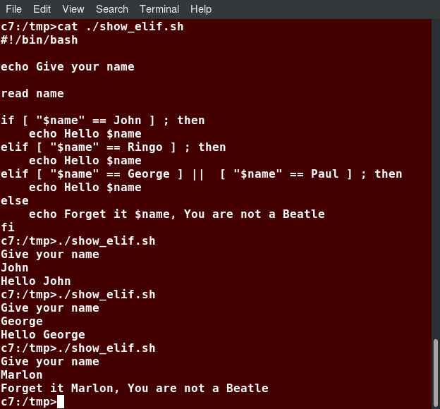

# The Bash Shell and Basic Scripting

## Command Shell Choices
The command interpreter is tasked with executing statements that follow it in the script. Linux provides a wide choice of shells; exactly what is available on the system is listed in the `/etc/shells` file.

## `sh` and `bash`
`sh` was written by Steve Bourne at AT&T in 1977, and is often known as the Bourne Shell. `bash` is a product of the GNU project and was created in 1987. It was designed as a major upgrade of `sh`; the name stands for Bourne Again Shell. On all Linux systems `sh` is just a link to `bash`, but scripts which are invoked as `sh` will only work without the `bash` extensions. 

## Shell Scripts
A shell is simply a command line interpreter which provides the user interface for terminal windows. A command shell can also be used to run scripts, even in non-interactive sessions without a terminal window, as if the commands were being directly typed in.

The first line of the script, `#!/bin/bash`, contains the full path of the command interpreter that is to be used on the file. The special two-character sequence, `#!`, is often called a shebang.

## A Simple `bash` Script
Save it as `hello.sh` and enter `chmod +x hello.sh` to make the file executable by all users:

```bash
#!/bin/bash
echo "Hello Linux Foundation Student"
```

You can then run the script by typing `./hello.sh` or by doing:

```bash
$ bash hello.sh
```

## Interactive Example Using bash Scripts
Create a file named `getname.sh` in your favorite editor with the following content:

```bash
#!/bin/bash
echo "ENTER YOUR NAME"
read name

# Display variable input
echo The name given was: $name
```

The user will be prompted to enter a value, which is then displayed on the screen. We can reference the value of a shell variable by using a `$` in front of the variable name, such as `$name`. 

Once again, make it executable by doing `chmod +x getname.sh`.

## Return Values
All shell scripts generate a return value upon finishing execution, which can be explicitly set with the exit statement. Return values permit a process to monitor the exit state of another process. 

As a script executes, one can check for a specific value or condition and return success or failure as the result. By convention, success is returned as zero, and failure is returned as any non-zero value. The return value is stored in the environment variable represented by `$?`:

```
$ ls /etc/logrotate.conf
/etc/logrotate.conf

$ echo $?
0
```

In this example, the system is able to locate the file `/etc/logrotate.conf` and `ls` returns a value of 0 to indicate success. When run on a non-existing file, it returns 2.

## Splitting Long Commands Over Multiple Lines
The concatenation operator (`\`), the backslash character, is used to continue long commands over several lines. It causes the shell to combine (concatenate) multiple lines and execute them as one single command. Here is an example of a command installing a long list of packages on a system using Debian package management:

```
$ sudo apt install autoconf automake bison build-essential \
  chrpath curl diffstat emacs flex gcc-multilib g++-multilib \ 
  libsdl1.2-dev libtool lzop make mc patch \
  screen socat sudo tar texinfo tofrodos u-boot-tools unzip \
  vim wget xterm zip
```

Note that the backslash character has another meaning of interpreting next character literally:

```bash
#!/bin/bash
echo \$HOME # $HOME
``` 

## Putting Multiple Commands on a Single Line
Users sometimes need to combine several commands and statements and even conditionally execute them based on the behavior of operators used in between them. This method is called chaining of commands.

There are several different ways to do this, depending on what you want to do. The `;` (semicolon) character is used to separate these commands and execute them sequentially, as if they had been typed on separate lines. Each ensuing command is executed whether or not the preceding one succeeded. Thus, the three commands in the following example will all execute, even if the ones preceding them fail: `make ; make install ; make clean`.

However, you may want to abort subsequent commands when an earlier one fails. You can do this using the `&&` (and) operator as in: `make && make install && make clean`.

A final refinement is to use the `||` (or) operator: `cat file1 || cat file2 || cat file3`. In this case, you proceed until something succeeds and then you stop executing any further steps.

## Output Redirection
With shell commands and scripts you can send the output to a file. The process of diverting the output to a file is called output redirection. 

The `>` character is used to write output to a file. For example, the following command sends the output of `free` to `/tmp/free.out`: `free > /tmp/free.out`.

Two `>` characters (`>>`) will append output to a file if it exists, and act just like `>` if the file does not already exist.

## Input Redirection
Just as the output can be redirected to a file, the input of a command can be read from a file. The process of reading input from a file is called input redirection and uses the `<` character.

The following three commands (using `wc` to count the number of lines, words and characters in a file) are entirely equivalent and involve input redirection, and a command operating on the contents of a file:

```bash
# 51  128 3038
# 51  128 3038 /etc/passwd
#    51     128    3038
wc < /etc/passwd
wc /etc/passwd
cat /etc/passwd | wc
```

## Script Parameters
Users often need to pass parameter values to a script:

```
$ ./script.sh /tmp
$ ./script.sh 100 200
```

Within a script, the parameter or an argument is represented with a `$` and a number or special character:
| Parameter | Meaning |
| - | - |
| `$0` | Script name |
| `$1` | First parameter |
| `$2`, `$3`, etc. | Second, third parameter, etc. |
| `$*` | All parameters |
| `$#` | Number of arguments |


## Command Substitution
At times, you may need to substitute the result of a command as a portion of another command. It can be done in two ways:
- By enclosing the inner command in `$()`
- By enclosing the inner command with backticks (`` ` ``)

The second form using backticks is deprecated, and its use should be avoided in new scripts and commands. No matter which method is used, the specified command will be executed in a newly launched shell environment, and the standard output of the shell will be inserted where the command substitution is done.


## Environment Variables
When referenced, environment variables must be prefixed with the `$` symbol, as in `$HOME`. You can view and set the value of environment variables. However, no prefix is required when setting or modifying the variable value: `MYCOLOR=blue`.

By default, the variables created within a script are available only to the subsequent steps of that script. Any child processes (sub-shells) do not have automatic access to the values of these variables. To make them available to child processes, they must be promoted to environment variables using the export statement: `export VAR=value`.

While child processes are allowed to modify the value of exported variables, the parent will not see any changes; exported variables are not shared, they are only copied and inherited.

Typing `export` with no arguments will give a list of all currently exported environment variables.


## Functions
A function is a code block that implements a set of operations. They are also often called subroutines. 


## The if Statement
When an if statement is used, the ensuing actions depend on the evaluation of specified conditions.

In the following example, an if statement checks to see if a certain file exists, and if the file is found, it displays a message indicating success or failure:

```bash
if [ -f "$1" ]
then
    echo file "$1" exists 
else
    echo file "$1" does not exist
fi
```

Notice the use of the square brackets (`[]`) to delineate the test condition. 

In modern scripts, you may see doubled brackets as in `[[ -f /etc/passwd ]]`. This is not an error. It is never wrong to do so and it avoids some subtle problems, such as referring to an environment variable without surrounding it in double quotes.

## The elif Statement
You can use the elif statement to perform more complicated tests, and take action appropriate actions.



## Testing for Files
bash provides a set of file conditionals that can be used with the if statement. In the following example,

```bash
# Note the very common practice of putting then on the same
# line as the if statement.
if [ -x /etc/passwd ] ; then
    echo "Executable"
fi
```

the if statement checks if the file `/etc/passwd` is executable, which it is not.

| Condition | Meaning |
| - | - |
| `-e file` | Checks if the file exists |
| `-d file` | Checks if the file is a directory |
| `-f file` | Checks if the file is a regular file (i.e., not a symbolic link, device node, directory, etc.) |
| `-s file` | Checks if the file is of non-zero size |
| `-r file` | Checks if the file is readable |
| `-w file` | Checks if the file is writable |
| `-x file` | Checks if the file is executable |

## Testing for Strings
You can use the if statement to compare strings using the operator `==` (two equal signs):


Note that using one `=` sign will also work, but some consider it deprecated usage. 

## Boolean Expressions
| Operator | Operation |
| - | - |
| `&&` | AND |
| `\|\|` | OR |
| `!` | NOT |

## Testing for Numbers
| Operator | Meaning |
| - | - |
| `-eq` | Equal to |
| `-ne` | Not equal to |
| `-gt` | Greater than |
| `-lt` | Less than |
| `-ge` | Greater than or equal to |
| `-le` | Less than or equal to |


## Arithmetic Expressions
Arithmetic expressions can be evaluated in the following three ways (spaces are important!):

- `expr` is a standard but somewhat deprecated program
    ```bash
    expr 8 + 8
    echo $(expr 8 + 8)
    ```

- Using the `$((...))` syntax, the built-in shell format
    ```bash
    echo $((x+1))
    ```

- Using the built-in shell command `let`
    ```bash
    let x=( 1 + 2 ); echo $x
    ```

In modern shell scripts, the use of `expr` is better replaced with `var=$((...))`.
