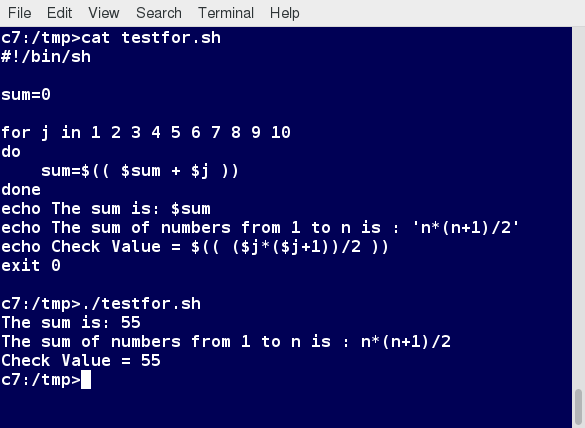
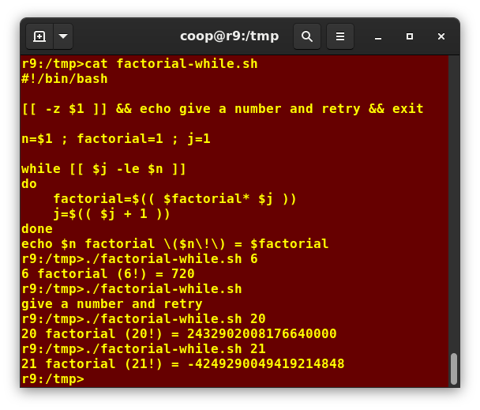
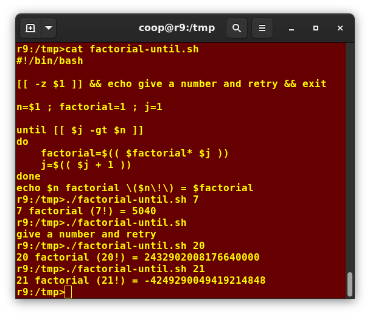

# More on Bash Shell Scripting

## String Manipulation
A string variable contains a sequence of text characters. In most cases, we can use single square brackets ( `[]` ) instead of double (`[[]]`) in comparisons and logical tests, but the more modern doubled form helps avoid some errors, such as those that can arise when doing a comparison with empty strings and environment variables.

| Operator | Meaning |
| - | - |
| `[[ string1 > string2 ]]` | Compares the sorting order of `string1` and `string2` |
| `[[ string1 == string2 ]]` | Compares the characters in `string1` with the characters in `string2` |
| `myLen1=${#string1}` | Saves the length of `string1` in the variable `myLen1` |

## Parts of a String
At times, you may not need to compare or use an entire string. To extract the first n characters of a string, we can specify `${string:0:n}`. Here, 0 is the offset in the string where the extraction needs to start, and `n` is the number of characters to be extracted. To extract all characters in a string after a dot (`.`), use the following expression: `${string#*.}`.

## Random Numbers and Data
Random numbers can be generated by using the `$RANDOM` environment variable, which is derived from the Linux kernel's built-in random number generator, or by the OpenSSL library function, which uses the FIPS140 (Federal Information Processing Standard) algorithm to generate random numbers for encryption.

```bash
# 25303
# 21001
# 25501
# 12057
# 26193
c1=5
until [[ $c1 -le 0 ]]; do
    echo "${RANDOM}"
    c1=$((c1-1))
done
```

### How the Kernel Generates Random Numbers
Some servers have hardware random number generators that take as input different types of noise signals, such as thermal noise and photoelectric effect. A transducer converts this noise into an electric signal, which is again converted into a digital number by an A-D converter. This number is considered random. However, most common computers do not contain such specialized hardware and, instead, rely on events created during booting to create the raw data needed.

Regardless of which of these two sources is used, the system maintains a so-called entropy pool of these digital numbers/random bits. Random numbers are created from this entropy pool.

The Linux kernel offers the `/dev/random` and `/dev/urandom` device nodes, which draw on the entropy pool to provide random numbers which are drawn from the estimated number of bits of noise in the entropy pool.

`/dev/random` is used where very high-quality randomness is required, such as a one-time pad or key generation, but it is relatively slow to provide values. `/dev/urandom` is faster and suitable (good enough) for most cryptographic purposes.

Furthermore, when the entropy pool is empty, `/dev/random` is blocked and does not generate any number until additional environmental noise is gathered, whereas `/dev/urandom` reuses the internal pool to produce more pseudo-random bits.

## The `for` Loop
The `for` loop operates on each element of a list of items. The syntax for the `for` loop is:

```
for variable-name in list
do
    execute one iteration for each item in the list until the list is finished
done
```

In this case, `variable-name` and `list` are substituted by you as appropriate. As with other looping constructs, the statements that are repeated should be enclosed by `do` and `done`.



## The `while` Loop
The `while` loop repeats a set of statements as long as the control command returns true:

```
while condition is true
do
    Commands for execution
done
```

The set of commands that need to be repeated should be enclosed between `do` and `done`. Often, the condition is enclosed within square brackets (`[]`).

Notice the integer overflow on the screenshot.



## The `until` Loop
The `until` loop repeats a set of statements as long as the control command is false:

```
until condition is false
do
    Commands for execution
done
```

Similar to the while loop, the set of commands that need to be repeated should be enclosed between `do` and `done`. You can use any command or operator as the condition.

Notice the integer overflow on the screenshot.



## The `case` Statement
Here is the basic structure of the `case` statement:

```
case expression in
    pattern1) execute commands;;
    pattern2) execute commands;;
    pattern3) execute commands;;
    pattern4) execute commands;;
    *)        execute some default commands or nothing;;
esac
```

Note that as soon as the expression matches a pattern successfully, the execution path exits; i.e., the further tests are neither executed nor evaluated. If none of the tests return success, the final choice will execute, which can be to do nothing.

```bash
f() {
    read input
    case $input in
        "1") echo "11";;
        "2") echo "22";;
        "3") echo "33";;
        *) echo "Only accepts 1, 2, or 3";;
    esac
}
```

## Script Debug Mode
You can run a bash script in debug mode either by doing `bash -x ./script_file`, or bracketing parts of the script with `set -x` and `set +x`. The debug mode helps identify the error because: 
- It traces and prefixes each command with the + character
- It displays each command before executing it
- It can debug only selected parts of a script (if desired) with:
  ```
  set -x    # turns on debugging
  ...
  set +x    # turns off debugging
  ```

## Discarding Output with `/dev/null`
Certain commands are quite capable of spewing voluminous and overwhelming amounts of output. To avoid this, we can redirect the large output to a special file (a device node) called `/dev/null`. This pseudofile is also called the bit bucket or black hole.

All data written to `/dev/null` is discarded. Furthermore, write operations never return failure conditions. Using the proper redirection operators, it can make the uninteresting output disappear from commands that would normally generate output to `stdout` and `stderr`: `ls -lR /tmp >& /dev/null`.
