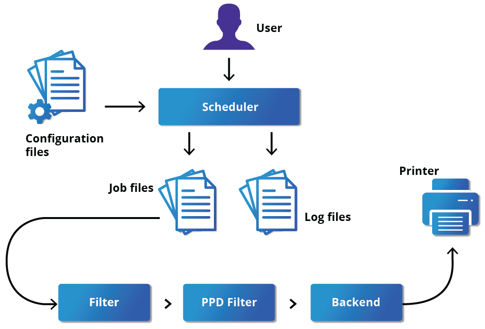
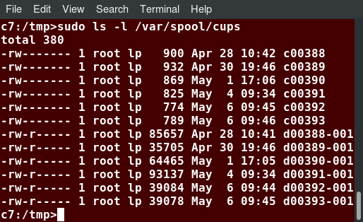
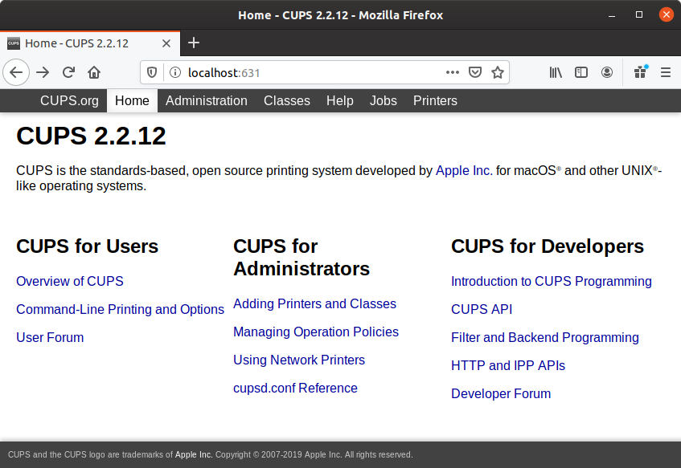
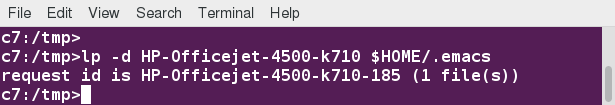

# Printing

To manage printers and print either directly from a local computer or across a networked environment, you need to know how to configure and install a printer. Printing itself requires software that converts information from the application you are using to a language your printer can understand. The Linux standard for printing software is the Common UNIX Printing System (CUPS).

## CUPS Overview
CUPS is the underlying software Linux systems use to print from applications. It interprets page descriptions produced by your application and then sends the information to the printer. It acts as a print server for both local and network printers.

Printers manufactured by different companies may use their own particular print languages and formats. CUPS uses a modular printing system that accommodates a wide variety of printers and also processes various data formats. This makes the printing process simpler; you can concentrate more on printing and less on how to print.

CUPS carries out the printing process with the help of its various components:



In short, when you execute a print command, the scheduler validates the command and processes the print job, creating job files according to the settings specified in the configuration files. Simultaneously, the scheduler records activities in the log files. Job files are processed with the help of the filter, printer driver, and backend, and then sent to the printer.

### Scheduler
CUPS is designed around a print scheduler that manages print jobs, handles administrative commands, allows users to query the printer status, and manages the flow of data through all CUPS components.

### Configuration Files
The print scheduler reads server settings from several configuration files, the two most important of which are cupsd.conf and printers.conf. These and all other CUPS-related configuration files are stored under the /etc/cups/ directory.

cupsd.conf is where most system-wide settings are located; it does not contain any printer-specific details. Most of the settings available in this file relate to network security, i.e., which systems can access CUPS network capabilities, how printers are advertised on the local network, what management features are offered, and so on.

printers.conf is where you will find the printer-specific settings. For every printer connected to the system, a corresponding section describes the printer's status and capabilities. This file is generated or modified only after adding a printer to the system and should not be modified by hand.

You can view the full list of configuration files by typing `ls -lF /etc/cups`.

### Job Files
CUPS stores print requests as files under the /var/spool/cups directory (these can actually be accessed before a document is sent to a printer). Data files are prefixed with the letter d, while control files are prefixed with the letter c. After a printer successfully handles a job, data files are automatically removed. These data files belong to what is commonly known as the print queue.



### Log Files
Log files are placed in /var/log/cups and are used by the scheduler to record activities that have taken place. These files include access, error, and page records. To view the log files, type `$ sudo ls -l /var/log/cups`.

### Filters, Printer Drivers, and Backends
CUPS uses filters to convert job file formats to printable formats. Printer drivers contain descriptions for currently connected and configured printers, and are usually stored under /etc/cups/ppd/. The print data is then sent to the printer through a filter, and via a backend that helps to locate devices connected to the system.

## Managing CUPS
Assuming CUPS has been installed you'll need to start and manage the CUPS daemon so that CUPS is ready for configuring a printer. Managing the CUPS daemon is simple; all management features can be done with the systemctl utility:

```
$ systemctl status cups
$ sudo systemctl [enable|disable] cups
$ sudo systemctl [start|stop|restart] cups
```

## Adding Printers from the CUPS Web Interface
Many users do not know CUPS comes with its own web server, which makes a configuration interface available via a set of CGI scripts. It is available at localhost:631.

Some pages require a username and password to perform certain actions, for example to add a printer. For most Linux distributions, you must use the root password to add, modify, or delete printers or classes.



## Printing from the Command-Line Interface
CUPS provides two command-line interfaces, descended from the System V and BSD flavors of UNIX. This means that you can use either lp (System V) or lpr (BSD) to print. 

lp is just a command line front-end to the lpr utility that passes input to lpr. In the example shown here, the task is to print $HOME/.emacs.



### Using lp
lp and lpr accept command line options that help you perform all operations that the GUI can accomplish. lp is typically used with a file name as an argument.

lpoptions can be used to set printer options and defaults. Each printer has a set of tags associated with it, such as the default number of copies and authentication requirements. You can type lpoptions help to obtain a list of supported options. lpoptions can also be used to set system-wide values, such as the default printer.

| Command | Usage |
| - | - |
| lp filename | To print the file to default printer |
| lp -d printer filename | To print to a specific printer |
| program \| lp <br> echo string \| lp | To print the output of a program |
| lp -n number filename | To print multiple copies |
| lpoptions -d printer | To set the default printer |
| lpq -a | To show the queue status |
| lpadmin | To configure printer queues |

### Managing Print Jobs
You send a file to the shared printer. But when you go there to collect the printout, you discover another user has just started a 200 page job that is not time sensitive. Your file cannot be printed until this print job is complete. What do you do now?

In Linux, command line print job management commands allow you to monitor the job state as well as managing the listing of all printers and checking their status, and canceling or moving print jobs to another printer.

| Command | Usage |
| - | - |
| lpstat -p -d | To get a list of available printers, along with their status |
| lpstat -a | To check the status of all connected printers, including job numbers |
| cancel job-id <br> lprm job-id | To cancel a print job |
| lpmove job-id newprinter | To move a print job to new printer |
