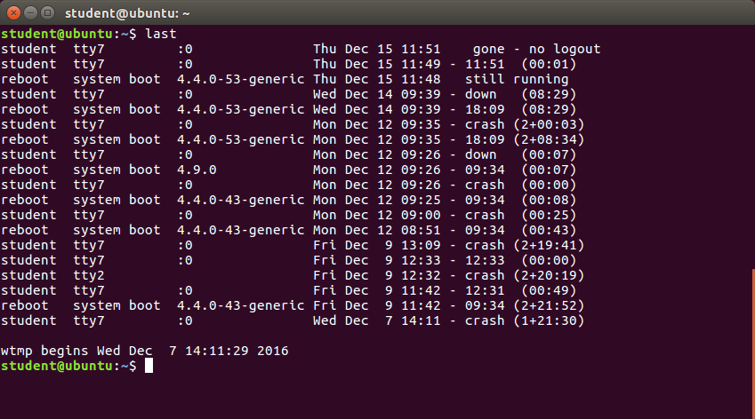
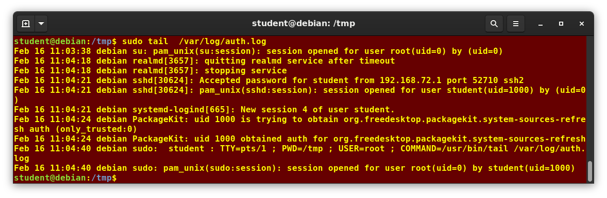
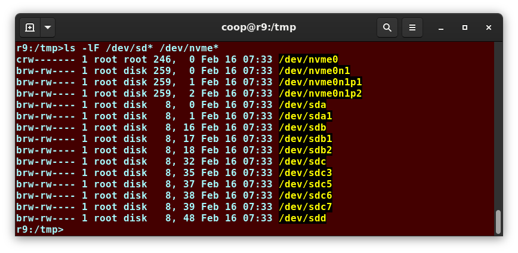

# Local Security Principles

## User Accounts
The Linux kernel allows properly authenticated users to access files and applications. While each user is identified by a unique integer (the user id or UID), a separate database associates a username with each UID. Upon account creation, new user information is added to the user database and the user's home directory must be created and populated with some essential files. For each user, the following seven fields are maintained in the `/etc/passwd` file: 

| Field Name | Details | Remarks |
| - | - | - |
| Username | User login name | Should be between 1 and 32 characters long |
| Password | User password (or the character `x` if the password is stored in the `/etc/shadow` file) in encrypted format | Is never shown in Linux when it is being typed |
| User ID (UID) | Every user must have a user id (UID) | - UID 0 is reserved for root user <br> - UID's ranging from 1-99 are reserved for other predefined accounts <br> - UID's ranging from 100-999 are reserved for system accounts and groups <br> - Normal users have UID's of 1000 or greater |
| Group ID (GID) | The primary Group ID (GID) stored in the `/etc/group` file | |
| User Info | This field is optional and allows insertion of extra information about the user such as their name | |
| Home Directory | The absolute path location of user's home directory | |
| Shell | The absolute location of a user's default shell | |

## Types of Accounts
By default, Linux distinguishes between several account types in order to isolate processes and workloads: root, System, Normal, and Network.

A regular account user can perform some operations requiring special permissions; however, the system configuration must allow such abilities to be exercised.

SUID (Set owner User ID upon execution) is a special kind of file permission given to a file. Use of SUID provides temporary permissions to a user to run a program with the permissions of the file owner (which may be `root`) instead of the permissions held by the user.

For a safe working environment, it is advised to grant the minimum privileges possible and necessary to accounts, and remove inactive accounts. The `last` utility, which shows the last time each user logged into the system, can be used to help identify potentially inactive accounts which are candidates for system removal.



### Understanding the `root` Account
`root` is the most privileged account on a Linux/UNIX system. This account has the ability to carry out all facets of system administration, including adding accounts, changing user passwords, examining log files, installing software, etc. It has no security restrictions imposed upon it. When you are signed in as, or acting as `root`, the shell prompt displays `#`. This convention is intended to serve as a warning to you of the absolute power of this account.

## `sudo` Features
`sudo` has the ability to keep track of unsuccessful attempts at gaining root access. Users' authorization for using `sudo` is based on configuration information stored in the `/etc/sudoers` file and in the `/etc/sudoers.d` directory.

A message such as the following would appear in a system log file (usually `/var/log/secure`) when trying to execute `sudo` without successful authentication:

```
badperson : user NOT in sudoers ; TTY=pts/4 ; PWD=/var/log ; USER=root ; COMMAND=/usr/bin/tail secure
```

## The sudoers File
Whenever `sudo` is invoked, a trigger will look at `/etc/sudoers` and the files in `/etc/sudoers.d` to determine if the user has the right to use `sudo` and what the scope of their privilege is. Unknown user requests and requests to do operations not allowed to the user even with `sudo` are reported. The basic structure of entries in these files is: `who where = (as_whom) what`.

Most Linux distributions now prefer you add a file in the directory `/etc/sudoers.d` with a name the same as the user. This file contains the individual user's sudo configuration, and one should leave the main configuration file untouched except for changes that affect all users.

You should edit any of these configuration files by using `visudo`, which ensures that only one person is editing the file at a time, has the proper permissions, and refuses to write out the file and exit if there are syntax errors in the changes made. The editing can be accomplished by doing a command such as the following ones:

```
# visudo /etc/sudoers
# visudo -f /etc/sudoers.d/student
```

## Command Logging
By default, sudo commands and any failures are logged in `/var/log/auth.log` under the Debian distribution family, and in `/var/log/messages` and/or `/var/log/secure` on other systems. 




## Process Isolation
Linux is considered to be more secure than many other operating systems because processes are naturally isolated from each other. More recent additional security mechanisms that limit risks even further include:

- Control Groups (`cgroups`)
  - Allows system administrators to group processes and associate finite resources
- Containers
  - Makes it possible to run multiple isolated Linux systems on a single system by `cgroups`
- Virtualization
  - Hardware is emulated in such a way that not only can processes be isolated, but entire systems are run simultaneously as isolated and insulated guests (virtual machines) on one physical host

## Hardware Device Access
Linux limits user access to non-networking hardware devices in a manner that is extremely similar to regular file access. Applications interact by engaging the filesystem layer. This layer will then open a device special file (often called a device node) under the `/dev` directory that corresponds to the device being accessed. Each device special file has standard owner, group and world permission fields.

Hard disks, for example, are represented as `/dev/sd*`. While a root user can read and write to the disk in a raw fashion by doing something like `# echo hello world > /dev/sda1`. The standard permissions, as shown in the figure, make it impossible for regular users to do so. Writing to a device in this fashion can easily obliterate the filesystem stored on it in a way that cannot be repaired without great effort, if at all. The normal reading and writing of files on the hard disk by applications is done at a higher level through the filesystem and never through direct access to the device node.



## How Passwords Are Stored
Originally, encrypted passwords were stored in the `/etc/passwd` file, which was readable by everyone. This made it rather easy for passwords to be cracked. On modern systems, passwords are actually stored in an encrypted format in a secondary file named `/etc/shadow`. Only those with root access can read or modify this file.

Most Linux distributions rely on a modern password encryption algorithm called SHA-512 (Secure Hashing Algorithm 512 bits), developed by the U.S. National Security Agency (NSA) to encrypt passwords.

## Good Password Practices
- Password aging is a method to ensure that users get prompts that remind them to create a new password after a specific period. It is implemented using `chage`, which configures the password expiry information for a user.
- Force users to set strong passwords using Pluggable Authentication Modules (PAM). PAM can be configured to automatically verify that a password created or modified using the `passwd` utility is sufficiently strong.
- One can also install password cracking programs to detect weak password entries.

## Requiring Boot Loader Passwords
You can secure the boot process with a secure password to prevent someone from bypassing the user authentication step. Note that while using a bootloader password alone will not prevent a user from booting from an alternative boot media such as optical disks or pen drives. Thus, it should be used with a BIOS password for full protection.

## Hardware Vulnerability
Your IT security policy should start with requirements on how to properly secure physical access to servers and workstations. When hardware is physically accessible, security can be compromised by:

- Key logging
- Network sniffing
- Booting with a live or rescue disk
- Remounting and modifying disk content

The guidelines of security are:

- Lock down workstations and servers
- Protect your network links such that it cannot be accessed by people you do not trust
- Protect your keyboards where passwords are entered to ensure the keyboards cannot be tampered with
- Ensure a password protects the BIOS in such a way that the system cannot be booted with a live or rescue DVD or USB key

## Software Vulnerability
When security problems in either the Linux kernel or applications and libraries are discovered, Linux distributions have a good record of reacting quickly and pushing out fixes to all systems by updating their software repositories and sending notifications to update immediately. The same thing is true with bug fixes and performance improvements that are not security related.

However, it is well known that many systems do not get updated frequently enough and problems which have already been cured are allowed to remain on computers for a long time; this is particularly true with proprietary operating systems where users are either uninformed or distrustful of the vendor's patching policy as sometimes updates can cause new problems and break existing operations. Many of the most successful attack vectors come from exploiting security holes for which fixes are already known but not universally deployed.
