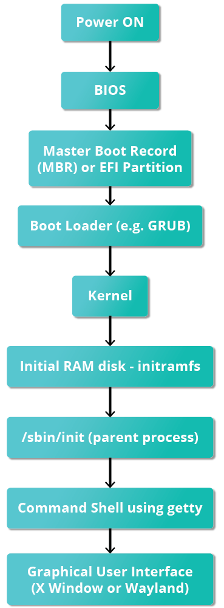
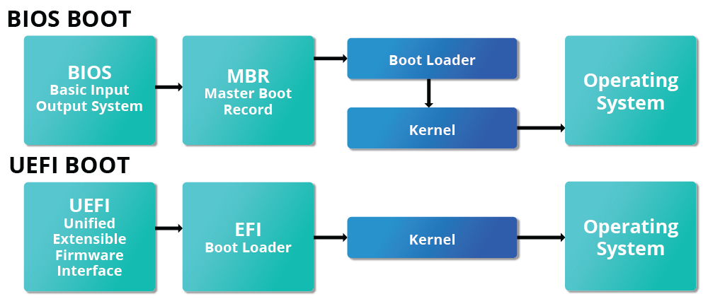
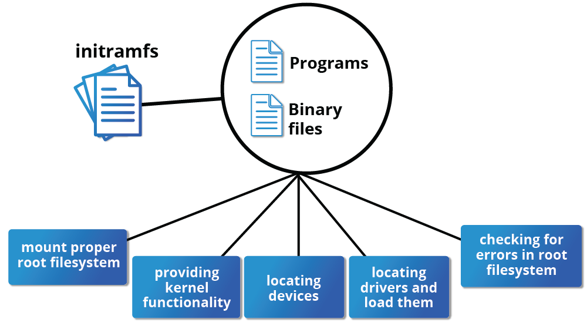
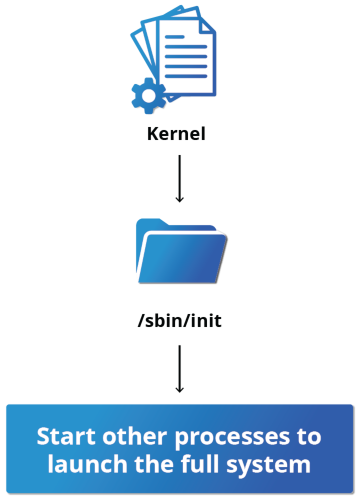

# Linux Basics and System Startup

### BIOS - The First Step
While Linux runs on many kinds of hardware, we will concentrate on the x86 family. When the computer is powered on, the Basic Input/Output System (BIOS) initializes the hardware, including the screen and keyboard, and tests the main memory. This process is also called POST (Power On Self Test).

The BIOS software is stored on a read-only memory (ROM) chip on the motherboard. After this, the remainder of the boot process is controlled by the operating system (OS).

### Master Boot Record (MBR), EFI Partition, and Boot Loader
Once the POST is completed, system control passes to the boot loader. The boot loader is usually stored on one of the system’s storage devices, such as a hard disk or SSD drive, either in the boot sector (for traditional BIOS/MBR systems) or the EFI partition (for more recent (Unified) Extensible Firmware Interface). Up to this stage, the machine does not access any mass storage media. Then, information on the date, time, and the most important peripherals are loaded from the CMOS values (after a technology used for the battery-powered memory store, which allows the system to keep track of the date and time even when it is powered off).

A number of boot loaders exist for Linux; the most common ones are GRUB (for GRand Unified Boot loader), ISOLINUX (for booting from removable media), and DAS U-Boot (for booting on embedded devices/appliances). Most Linux boot loaders can present a user interface for choosing alternative options for booting Linux and even other operating systems that might be installed. When booting Linux, the boot loader is responsible for loading the kernel image and the initial RAM disk or filesystem (which contains some critical files and device drivers needed to start the system) into memory.

### Boot Loader in Action
The boot loader has two distinct stages:

For systems using the BIOS/MBR method, the boot loader resides at the first sector of the hard disk, also known as the Master Boot Record (MBR). The size of the MBR is just 512 bytes. In this stage, the boot loader examines the partition table and finds a bootable partition. Once it finds a bootable partition, it then searches for the second stage boot loader, for example GRUB, and loads it into RAM (Random Access Memory). For systems using the EFI/UEFI method, UEFI firmware reads its Boot Manager data to determine which UEFI application is to be launched and from where (i.e., from which disk and partition the EFI partition can be found). The firmware then launches the UEFI application, for example GRUB, as defined in the boot entry in the firmware's boot manager. This procedure is more complicated but more versatile than the older MBR methods.

The second stage boot loader resides under /boot. A splash screen is displayed, which allows us to choose which operating system (OS) and/or kernel to boot. After the OS and kernel are selected, the boot loader loads the kernel of the operating system into RAM and passes control to it. Kernels are almost always compressed, so the first job they have is to uncompress themself. After this, it will check and analyze the system hardware and initialize any hardware device drivers built into the kernel.

### Initial RAM Disk
The initramfs filesystem image contains programs and binary files that perform all actions needed to mount the proper root filesystem, including providing the kernel functionality required for the specific filesystem that will be used, and loading the device drivers for mass storage controllers, by taking advantage of the udev system (for user device), which is responsible for figuring out which devices are present, locating the device drivers they need to operate properly, and loading them. After the root filesystem has been found, it is checked for errors and mounted.

The mount program instructs the operating system that a filesystem is ready for use and associates it with a particular point in the overall hierarchy of the filesystem (the mount point). If this is successful, the initramfs is cleared from RAM, and the init program on the root filesystem (/sbin/init) is executed.

init handles the mounting and pivoting over to the final real root filesystem. If special hardware drivers are needed before the mass storage can be accessed, they must be in the initramfs image.

### Text-Mode Login
Near the end of the boot process, init starts a number of text-mode login prompts. These enable you to type your username, followed by your password, and to eventually get a command shell. However, if you are running a system with a graphical login interface, you will not see these at first. The terminals which run the command shells can be accessed using the ALT key plus a function key. Most distributions start six text terminals and one graphics terminal starting with F1 or F2. Within a graphical environment, switching to a text console requires pressing CTRL-ALT + the appropriate function key (with F7 or F1 leading to the GUI).

## Kernel, init and Services

### The Linux Kernel
The boot loader loads both the kernel and an initial RAM–based file system (initramfs) into memory, so it can be used directly by the kernel. When the kernel is loaded in RAM, it immediately initializes and configures the computer’s memory and also configures all the hardware attached to the system. The kernel also loads some necessary user space applications.

### /sbin/init and Services
Once the kernel has set up all its hardware and mounted the root filesystem, the kernel runs /sbin/init. This then becomes the initial process, which then starts other processes to get the system running. Most other processes on the system trace their origin ultimately to init; exceptions include the so-called kernel processes. These are started by the kernel directly, and their job is to manage internal operating system details.

Besides starting the system, init is responsible for keeping the system running and for shutting it down cleanly. One of its responsibilities is to act when necessary as a manager for all non-kernel processes; it cleans up after them upon completion, and restarts user login services as needed when users log in and out, and does the same for other background system services.

Traditionally, this process startup was done using conventions that date back to the 1980s and the System V variety of UNIX. This serial process (called SysVinit) had the system pass through a sequence of runlevels containing collections of scripts that start and stop services. Each runlevel supported a different mode of running the system. Within each runlevel, individual services could be set to run, or to be shut down if running.

However, all major distributions have moved away from this sequential method of system initialization, although they usually can emulate many System V utilities for compatibility purposes.

### Startup Alternatives
SysVinit viewed things as a serial process, divided into a series of sequential stages. Each stage required completion before the next could proceed. Thus, startup did not easily take advantage of the parallel processing that could be done with the multiple processors or cores found on modern systems.

Furthermore, starting up and rebooting were seen as relatively rare events; exactly how long they took was not considered important. This is no longer true, especially with mobile devices and embedded Linux systems. Some modern methods, such as the use of containers, can require almost instantaneous startup times. Thus, systems now require methods with faster and enhanced capabilities. Finally, the older methods required rather complicated startup scripts, which were difficult to keep universal across distribution versions, kernel versions, architectures, and types of systems. The two main alternatives developed were:

- Upstart
  - Developed by Ubuntu and first included in 2006
  - Adopted in Fedora 9 (in 2008) and in RHEL 6 and its clones
- systemd
  - Adopted by Fedora first (in 2011)
  - Adopted by RHEL 7 and SUSE
  - Replaced Upstart in Ubuntu 16.04

While the migration to systemd was rather controversial, it has been adopted by all major distributions, and so we will not discuss the older System V method or Upstart, which has become a dead end. Regardless of how one feels about the controversies or the technical methods of systemd, almost universal adoption has made learning how to work on Linux systems simpler, as there are fewer differences among distributions.

### systemd Features
Systems with systemd start up faster than those with earlier init methods. This is largely because it replaces a serialized set of steps with aggressive parallelization techniques, which permits multiple services to be initiated simultaneously.

Complicated startup shell scripts are replaced with simpler configuration files, which enumerate what has to be done before a service is started, how to execute service startup, and what conditions the service should indicate have been accomplished when startup is finished. One thing to note is that /sbin/init now just points to /lib/systemd/systemd.

- Starting, stopping, restarting a service on a currently running system
  - `sudo systemctl start|stop|restart service`
- Enabling or disabling a system service from starting up at system boot
  - `sudo systemctl enable|disable service`
- Checking on the status of a service:
  - `sudo systemctl status service`

## Linux Filesystem Basics

### Partitions and Filesystems
A partition is a dedicated subsection of physical storage media. Historically this meant a physically contiguous portion of a hard disk; today's storage devices can be more complicated, but we still think of a partition as a fixed area to be treated as a whole. A filesystem is just a method of storing and accessing files. One can think of a partition as a container in which a filesystem resides. However, in some circumstances, a filesystem can span more than one partition if one uses symbolic links, which we will discuss much later.

### The Filesystem Hierarchy Standard
Linux systems store their important files according to a standard layout called the Filesystem Hierarchy Standard (FHS). It uses / to separate paths and does not have drive letters. Multiple drives and/or partitions are mounted as directories in the single filesystem. Removable media such as USB drives and CDs, and DVDs will show up as mounted at /run/media/yourusername/disklabel for recent Linux systems or under /media for older distributions.

All Linux filesystem names are case-sensitive, so /boot, /Boot, and /BOOT represent three different directories (or folders). Many distributions distinguish between core utilities needed for proper system operation and other programs, and place the latter in directories under /usr.

Nearly all Linux distribution installers provide a reasonable default layout, with either all space dedicated to normal files on one big partition and a smaller swap partition or with separate partitions for some space-sensitive areas like /home and /var. You may need to override the defaults and do something different if you have special needs or if you want to use more than one disk.

