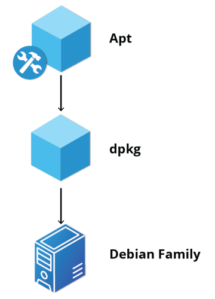

# System Configuration from the Graphical Interface

The System Settings panel allows you to control most of the basic configuration options and desktop settings, such as specifying the screen resolution, managing network connections, or changing the date and time of the system.

## Display Settings
If your system uses a proprietary video card driver (usually from nVidia or AMD), you will probably have a separate configuration program for that driver. This program may give more configuration options, but may also be more complicated, and might require sysadmin (root) access. If possible, you should configure the settings in the Displays panel rather than with the proprietary program.

On systems utilizing the X Window system, the server which actually provides the GUI, uses /etc/X11/xorg.conf as its configuration file if it exists; In modern Linux distributions, this file is usually present only in unusual circumstances, such as when certain less common graphic drivers are in use.

## Date and Time Settings
By default, Linux always uses Coordinated Universal Time (UTC) for its own internal timekeeping. Displayed or stored time values rely on the system time zone setting to get the proper time. UTC is similar to, but more accurate than, Greenwich Mean Time (GMT).

The "Automatic Date & Time" switch is referring to the use of Network Time Protocol (NTP). NTP is the most popular and reliable protocol for setting the local time by consulting established Internet servers. Linux distributions always come with a working NTP setup, which refers to specific time servers run or relied on by the distribution.

## Network Configuration
All Linux distributions have network configuration files, but file formats and locations can differ from one distribution to another. Hand editing of these files can handle quite complicated setups, but is not very dynamic or easy to learn and use. Network Manager was developed to make things easier and more uniform across distributions. It can list all available networks (both wired and wireless), allow the choice of a wired, wireless, or mobile broadband network, handle passwords, and set up Virtual Private Networks (VPNs). Except for unusual situations, it is generally best to let Network Manager establish your connections and keep track of your settings.

### Wired and Wireless Connections
Wired connections usually do not require complicated or manual configuration. The hardware interface and signal presence are automatically detected, and then Network Manager sets the actual network settings via Dynamic Host Configuration Protocol (DHCP).

For static configurations that do not use DHCP, manual setup can also be done easily through Network Manager. You can also change the Ethernet Media Access Control (MAC) address if your hardware supports it.

Wireless networks are usually not connected by default. You can view the list of available wireless networks and see which one (if any) you are currently connected to by using Network Manager. You can then add, edit, or remove known wireless networks, and also specify which ones you want connected by default when present.

## Installing and Updating Software
Each package in a Linux distribution provides one piece of the system, such as the Linux kernel, the C compiler, utilities for manipulating text or configuring the network, or for your favorite web browsers and email clients.

Packages often depend on each other. For example, because your email client can communicate using SSL/TLS, it will depend on a package that provides the ability to encrypt and decrypt SSL and TLS communication and will not install unless that package is also installed at the same time.

All systems have a lower-level utility that handles the details of unpacking a package and putting the pieces in the right places. However, most of the time, you will be working with a higher-level utility that knows how to download and install packages directly from the Internet and can manage dependencies and groups for you.

### Debian Packaging
dpkg is a package manager. It can install, remove, and build packages. Unlike higher-level package management systems, it does not automatically download and install packages and satisfy their dependencies.

For Debian-based systems, the higher-level package management system is the Advanced Package Tool (APT) system of utilities. Generally, while each distribution within the Debian family uses APT, it creates its own utilities on top of it. Although apt repositories are generally compatible with each other, the software they contain generally is not. Therefore, most repositories target a particular distribution (like Ubuntu), and often software distributors ship with multiple repositories to support multiple distributions. 

### Red Hat Package Manager (RPM)
Red Hat Package Manager (RPM) is another package management system. It was developed by Red Hat and adopted by a number of other distributions, including Fedora, CentOS, SUSE/openSUSE, Oracle Linux, and others.

The higher-level package manager differs between distributions. Red Hat family distributions historically use RHEL/CentOS, and Fedora uses dnf, while SUSE family distributions such as openSUSE also use RPM but use the zypper interface.

