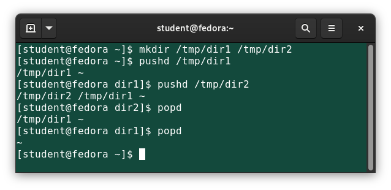
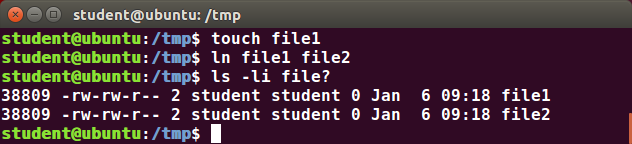
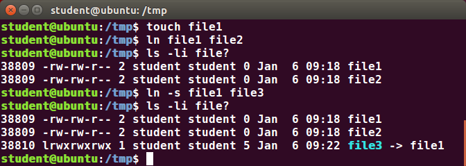

# Command Line Operations

A terminal emulator simulates a standalone terminal within a window on the desktop. It behaves essentially as if you were logging into the machine at a pure text terminal with no graphical interface.

## The Command Line

Most input lines entered at the shell prompt have three basic elements: command, options, and arguments.

The command is the name of the program or script you are executing. It may be followed by one or more options that modify what the command may do. Options usually start with one or two dashes, for example, `-p` or `--print`, in order to differentiate them from arguments, which represent what the command operates on.

### `sudo`

`sudo` allows users to run programs using the security privileges of another user, generally root. 

If your system does not already have `sudo` set up and enabled:

1. You will need to make modifications as the administrative, or superuser, root. While `sudo` will become the preferred method of doing this, we do not have it set up yet, so we will need to use `su` instead. At the command line prompt, type `su` and press Enter. You will then be prompted for the root password, so enter it and press Enter. You will notice that nothing is printed; this is so others cannot see the password on the screen. You should end up with a different looking prompt, often ending with `#`.

    ```
    $ su Password:
    #
    ```

2. Now, you need to create a configuration file to enable your user account to use `sudo`. Typically, this file is created in the `/etc/sudoers.d/` directory with the name of the file the same as your username. For example, for this demo, let's say your username is `student`. You would then create the configuration file for `student` by doing this:

    ```
    # echo "student ALL=(ALL) ALL" > /etc/sudoers.d/student
    ```

   - Some Linux distributions will complain if you do not also change permissions on the file by doing `chmod 440 /etc/sudoers.d/student`.

## Virtual Terminals

Virtual Terminals (VT) are console sessions that use the entire display and keyboard outside of a graphical environment. Such terminals are considered "virtual" because, although there can be multiple active terminals, only one terminal remains visible at a time. A VT is not the same as a command line terminal window; you can have many of those visible simultaneously on a graphical desktop.

One virtual terminal (usually VT 1 or VT 7) is reserved for the graphical environment, and text logins are enabled on the unused VTs. 

To switch between VTs, press CTRL-ALT-function key for the VT. For example, press CTRL-ALT-F6 for VT 6. If you are in a VT already and want to switch to another VT, you only have to press ALT-function key.

## Turning Off the Graphical Desktop

Linux distributions can start and stop the graphical desktop in various ways. For the newer system-based distributions, you can stop the GUI desktop with `systemctl` or the `telinit` command:

```
$ sudo systemctl stop gdm
```

```
$ sudo telinit 3
```

You can restart it (after logging into the console) with:

```
$ sudo systemctl start gdm
```

```
$ sudo telinit 5
```

## Rebooting and Shutting Down

The preferred method to shut down or reboot the system is to use the `shutdown` command. This sends a warning message, and then prevents further users from logging in. The `init` process will then control shutting down or rebooting the system. It is important to always shut down properly; failure to do so can result in damage to the system and/or loss of data.

The `halt` and `poweroff` commands issue `shutdown -h` to halt the system; reboot issues `shutdown -r` and causes the machine to reboot instead of just shutting down. Both rebooting and shutting down from the command line requires superuser (root) access.

When administering a multi-user system, you have the option of notifying all users prior to shutdown: `$ sudo shutdown -h 10:00 "Shutting down for scheduled maintenance."`

## Locating Applications

One way to locate programs is to employ the `which` utility. For example, to find out exactly where the `diff` program resides on the filesystem:

```
$ which diff
/usr/bin/diff
```

If `which` does not find the program, `whereis` is a good alternative because it looks for packages in a broader range of system directories:

```
$ whereis diff
diff: /usr/bin/diff /usr/share/man/man1/diff.1.gz /usr/share/man/man1p/diff.1p.gz
```

## Accessing Directories

When you first log into a system or open a terminal, the default directory should be your home directory. You can see the exact location by typing `echo $HOME`.

| Command | Usage |
| --------- | -------- |
| `pwd` | Displays the present working directory |
| `cd ~` <br /> `cd` | Change to your home directory |
| `cd ..` | Change to parent directory (..) |
| `cd -` | Change to previous working directory |

## Understanding Absolute and Relative Paths

An absolute pathname begins with the root directory (`/`) and follows the tree, branch by branch, until it reaches the desired directory or file. A relative pathname starts from the present working directory. Relative paths never start with `/`.

Multiple slashes (`/`) between directories and files are allowed, all but one slash between elements in the pathname are ignored by the system. For example, `////usr//bin` is seen as just `/usr/bin` by the system.

For example, suppose you are currently working in `/home/fred` and wish to move to the `/usr/bin` directory:

- Absolute pathname method: `$ cd /usr/bin`
- Relative pathname method: `$ cd ../../usr/bin`


## Exploring the Filesystem

| Command | Usage |
| --------- | -------- |
| `ls` | List the contents of the present working directory |
| `ls -a` | List all files, including hidden files and directories (those whose name start with `.`) |
| `df -h` | Report file system disk space usage with sizes in powers of 1024 |

## Navigating the Directory History

For remembering more than just the last directory visited, use `pushd` to change the directory instead of `cd`; this pushes your starting directory onto a list. Using `popd` will then send you back to those directories, walking in reverse order (the most recent directory will be the first one retrieved). The entire list is displayed with the `dirs` command.



## Wildcards and Matching File Names

| Wildcard | Result |
| --------- | -------- |
| `?` | Matches any single character |
| `*` | Matches any string of characters |
| `[set]` | Matches any character in the set of characters |
| `[!set]` | Matches any character not in the set of characters |

## Hard Links

Suppose that `file1` already exists. A hard link, called `file2`, is created with the command: `$ ln file1 file2`

Note that two files now appear to exist. However, a closer inspection of the file listing shows that this is not quite true: `$ ls -li file1 file2`. The `-i` option prints out the inode number in the first column, which is a unique quantity for each file object. What is really going on here is that it is only one file, but it has more than one name associated with it, as is indicated by the 2 that appears in the output.



Hard links are very useful and they save space, but you have to be careful with their use, sometimes in subtle ways. For one thing, if you remove either `file1` or `file2` in the example, the inode object (and the remaining file name) will remain, which might be undesirable, as it may lead to subtle errors later if you recreate a file of that name.

If you edit one of the files, exactly what happens depends on your editor; most editors will retain the link by default, but it is possible that modifying one of the names may break the link and result in the creation of two objects.

## Soft Links

Soft (or Symbolic) links are created with the `-s` option: `$ ln -s file1 file3`.

Notice `file3` no longer appears to be a regular file, and it clearly points to `file1` and has a different inode number.



Symbolic links take no extra space on the filesystem (unless their names are very long). They are extremely convenient, as they can easily be modified to point to different places.

Unlike hard links, soft links can point to objects even on different filesystems, partitions, and/or disks and other media. In the case where the link does not point to a currently available or existing object, you obtain a dangling link.

## Viewing Files

| Command | Usage |
| --------- | -------- |
| `cat` | Used for viewing files that are not very long; it does not provide any scroll-back |
| `tac` | Used to look at a file backwards, starting with the last line |
| `less` | Used to view larger files - it pauses at each screen full of text, provides scroll-back capabilities, and lets you search and navigate within the file |
| `tail` | Used to print the last 10 lines of a file by default. You can change the number of lines by doing `-n 15` or just `-15` if you wanted to look at the last 15 lines instead of the default |
| `head` | The opposite of `tail`; by default, it prints the first 10 lines of a file |

## `touch`

`touch` is often used to set or update the access, change, and modify times of files. By default, it resets a file's timestamp to match the current time. However, you can also create an empty file: `$ touch <filename>`.

`touch` provides several useful options. For example, the `-t` option allows you to set the date and timestamp of the file to a specific value: `$ touch -t 12091600 myfile`. This sets the myfile file's timestamp to 4 p.m., December 9th (12 09 1600).

## `mkdir`

`mkdir` is used to create a directory:

- `mkdir sampdir`
  - It creates a sample directory named `sampdir` under the current directory
- `mkdir /usr/sampdir`
  - It creates a sample directory called `sampdir` under `/usr`
- `mkdir -p /tmp/somedir/subdir`
  - It creates a sample directory named `subdir` even if `somedir/` or `tmp/` does not exist

## Moving, Renaming or Removing a File

Note that `mv` can:

- Simply rename a file
- Move a file to another location, while possibly changing its name at the same time

| Command | Usage |
| --------- | -------- |
| `mv` | Rename a file |
| `rm` | Remove a file |
| `rm -f` | Forcefully remove a file |
| `rm -i` | Interactively remove a file |

## Renaming or Removing a Directory

| Command | Usage |
| --------- | -------- |
| `mv` | Rename a directory |
| `rmdir` | Remove an empty directory |
| `rm -rf` | Forcefully remove a directory recursively |

## Standard File Streams

When commands are executed, by default there are three standard file streams (or descriptors) always open for use: standard input (standard in or `stdin`), standard output (standard out or `stdout`) and standard error (or `stderr`).

Usually, `stdin` is your keyboard, and `stdout` and `stderr` are printed on your terminal. `stderr` is often redirected to an error logging file, while `stdin` is supplied by directing input to come from a file or from the output of a previous command through a pipe. `stdout` is also often redirected into a file. Since `stderr` is where error messages (and warning) are written, usually nothing will go there.

In Linux, all open files are represented internally by what are called file descriptors. Simply put, these are represented by numbers starting at zero. `stdin` is file descriptor 0, `stdout` is file descriptor 1, and `stderr` is file descriptor 2. Typically, if other files are opened in addition to these three, which are opened by default, they will start at file descriptor 3 and increase from there.

| Name | Symbolic Name | Value |
| --------- | -------- | -------- |
| standard input | `stdin` | 0 |
| standard output | `stdout` | 1 |
| standard error | `stderr` | 2 |

### I/O Redirection

Through the command shell, we can redirect the three standard file streams so that we can get input from either a file or another command, and we can write output and errors to files or use them to provide input for subsequent commands.

If we have a program called `do_something` that reads from `stdin` and writes to `stdout` and `stderr`, we can change its input source by using the less-than sign (`<`) followed by the name of the file to be consumed for input data: `$ do_something < input-file`. If you want to send the output to a file, use the greater-than sign (`>`) as in: `$ do_something > output-file`. In fact, you can do both at the same time as in: `$ do_something < input-file > output-file`.

Because `stderr` is not the same as `stdout`, error messages will still be seen on the terminal windows in the above example. If you want to redirect `stderr` to a separate file, you use `stderr`'s file descriptor number (2), the greater-than sign (`>`), followed by the name of the file you want to receive everything the running command writes to `stderr`: `$ do_something 2> error-file`. Note that a special shorthand notation can send anything written to file descriptor 2 (`stderr`) to the same place as file descriptor 1 (`stdout`): `$ do_something > all-output-file 2>&1`.

bash permits an easier syntax for the above: `$ do_something >& all-output-file`.

### Pipes

The UNIX/Linux philosophy is to have many simple and short programs (or commands) cooperate together to produce quite complex results, rather than have one complex program with many possible options and modes of operation. In order to accomplish this, extensive use of pipes is made. You can pipe the output of one command or program into another as its input.

In order to do this, we use the vertical-bar, pipe symbol (`|`), between commands as in: `$ command1 | command2 | command3`.

The above represents what we often call a pipeline, and allows Linux to combine the actions of several commands into one. This is extraordinarily efficient because `command2` and `command3` do not have to wait for the previous pipeline commands to complete before they can begin processing at the data in their input streams; on multiple CPU or core systems, the available computing power is much better utilized and things get done quicker.

## `locate`

The `locate` utility program performs a search while taking advantage of a previously constructed database of files and directories on your system, matching all entries that contain a specified character string.

To get a shorter (and possibly more relevant) list, we can use the `grep` program as a filter. `grep` will print only the lines that contain one or more specified strings, as in: 

```
$ locate zip | grep bin
```

which will list all the files and directories with both zip and bin in their name. 

The database is created by a related utility `updatedb`. Most Linux systems run this automatically once a day. However, you can update it at any time by just running `updatedb` from the command line as the root user.

## `find`

`find` recurses down the filesystem tree from any particular directory (or set of directories) and locates files that match specified conditions. The default pathname is always the present working directory.

When no arguments are given, `find` lists all files in the current directory and all of its subdirectories. Commonly used options to shorten the list include `-name` (only list files with a certain pattern in their name), `-iname` (ignore the case of file names), and `-type` (which will restrict the results to files of a certain specified type, such as `d` for directory, `l` for symbolic link, or `f` for a regular file, etc.). 

Searching for files and directories named `gcc`: `$ find /usr -name gcc`.

Searching only for directories named `gcc`: `$ find /usr -type d -name gcc`.

Searching only for regular files named `gcc`: `$ find /usr -type f -name gcc`.

To find and remove all files that end with `.swp`: `$ find -name "*.swp" -exec rm {} ';'`. The `{}` (squiggly brackets) is a placeholder that will be filled with all the file names that result from the find expression, and the command will be run on each one individually. Please note that you have to end the command with either `';'` (including the single-quotes) or `\\;`.

To find files based on time: `$ find / -ctime 3`. Here, `-ctime` is when the inode metadata last changed; it is often, but not necessarily, when the file was first created. You can also search for accessed/last read (`-atime`) or modified/last written (`-mtime`) times. The number is the number of days and can be expressed as either a number (`n`) that means exactly that value, `+n`, which means greater than that number, or `-n`, which means less than that number. There are similar options for times in minutes (as in `-cmin`, `-amin`, and `-mmin`).

To find files based on sizes: `$ find / -size 0`. Note the size here is in 512-byte blocks, by default; you can also specify bytes (`c`), kilobytes (`k`), megabytes (`M`), gigabytes (`G`), etc. As with the time numbers above, file sizes can also be exact numbers (`n`), `+n` or `-n`. For example, to find files greater than 10 MB in size and running a command on those files: `$ find / -size +10M -exec command {} ';'`.
