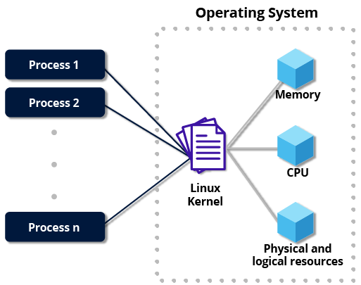
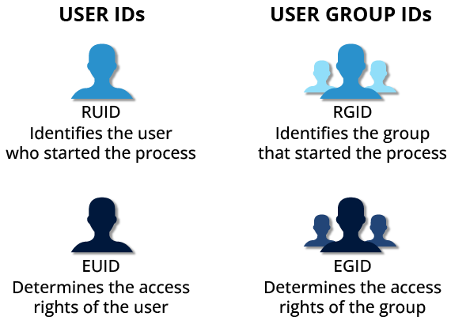
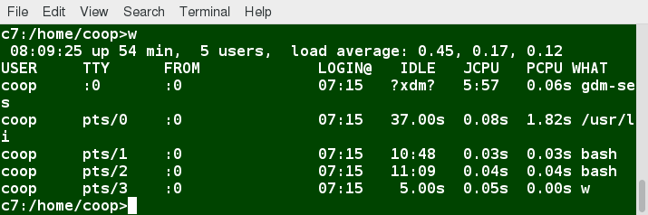
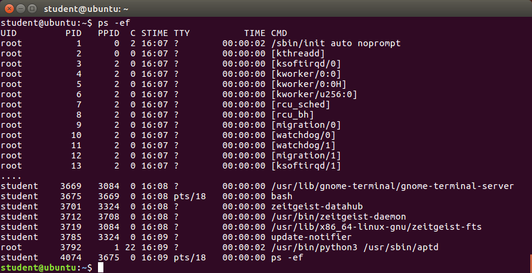
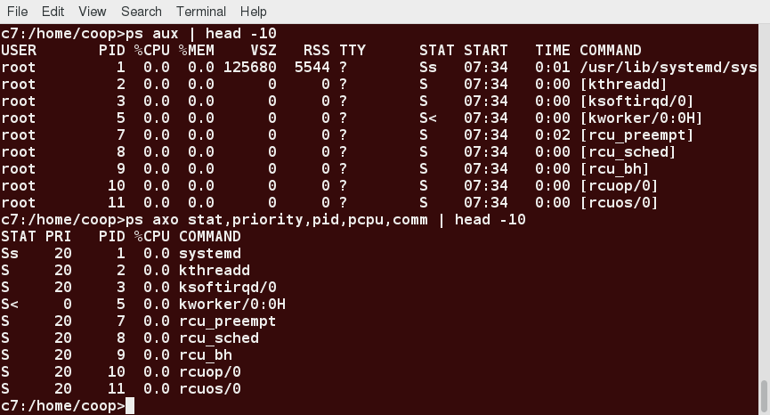
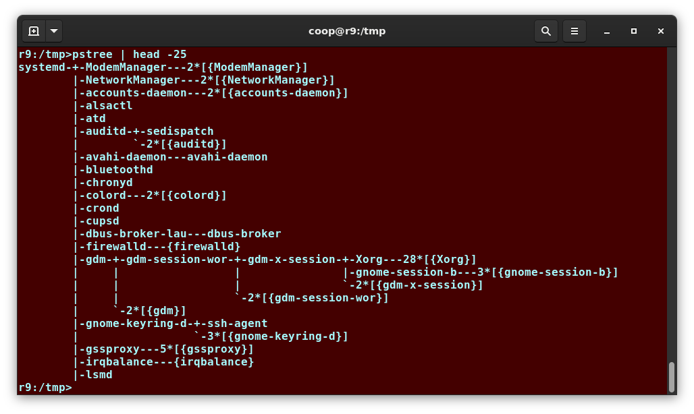
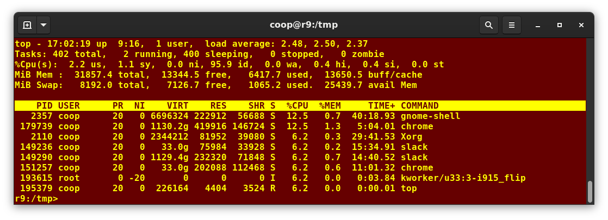
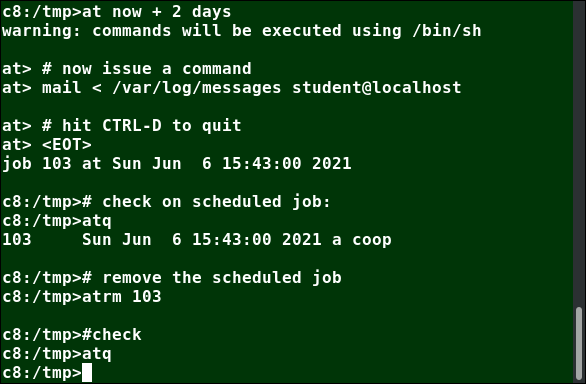
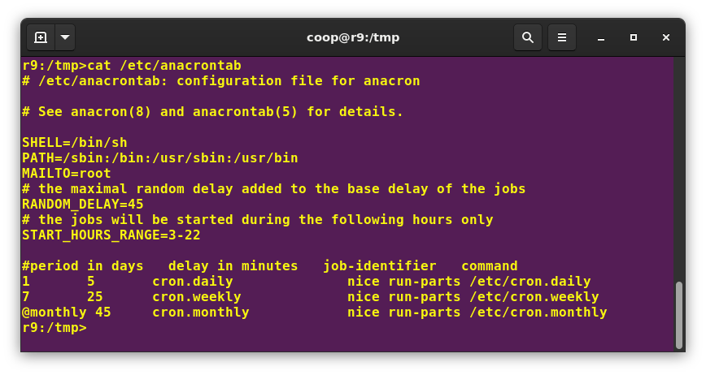

# Processes

## What is a Process?
A process is simply an instance of one or more related tasks (threads) executing on your computer. It is not the same as a program or a command. A single command may actually start several processes simultaneously. A failure of one process may or may not affect the others running on the system.

Processes use many system resources, such as memory, CPU cycles, and peripheral devices. The operating system (especially the kernel) is responsible for allocating a proper share of these resources to each process and ensuring overall optimized system utilization.



| Process Type | Description | Examples |
| - | - | - |
Interactive Processes | Need to be started by a user, either at a command line or through a graphical interface. | bash, firefox, top, Slack, Libreoffice
Batch Processes | Automatic processes which are scheduled from and then disconnected from the terminal. These tasks are queued and work on a FIFO (First-In, First-Out) basis. | updatedb, ldconfig
Daemons | Server processes that run continuously. Many are launched during system startup and then wait for a user or system request indicating that their service is required. | httpd, sshd, libvirtd, cupsd
Threads | Lightweight processes. These are tasks that run under the umbrella of a main process, sharing memory and other resources, but are scheduled and run by the system on an individual basis. An individual thread can end without terminating the whole process and a process can create new threads at any time. | dconf-service, gnome-terminal-server
Kernel Threads | Kernel tasks that users neither start nor terminate and have little control over. These may perform actions like moving a thread from one CPU to another, or making sure input/output operations to disk are completed. | kthreadd, migration, ksoftirqd

## Process Scheduling and States
A critical kernel function called the scheduler constantly shifts processes on and off the CPU, sharing time according to relative priority, how much time is needed and how much has already been granted to a task.

When a process is in a so-called running state, it means it is either currently executing instructions on a CPU, or is waiting to be granted a share of time (a time slice) so it can execute. All processes in this state reside on what is called a run queue and on a computer with multiple CPUs, or cores, there is a run queue on each. As noted, the word running is a little misleading as the process may actually be swapped out, waiting its turn to get back in the race.

However, sometimes processes go into what is called a sleep state, generally when they are waiting for something to happen before they can resume, perhaps for the user to type something. In this condition, a process is said to be sitting in a wait queue.

There are some other less frequent process states, especially when a process is terminating. Sometimes, a child process completes, but its parent process has not asked about its state. Amusingly, such a process is said to be in a zombie state; it is not really alive, but still shows up in the system's list of processes.

## Process and Thread IDs
At any given time, there are always multiple processes being executed. The operating system keeps track of them by assigning each a unique process ID (PID) number. New PIDs are usually assigned in ascending order as processes are born. Thus, PID 1 denotes the init process (system initialization process), and succeeding processes are gradually assigned higher numbers.

| ID Type | Description |
| - | - |
Process ID (PID) | Unique Process ID number.
Parent Process ID (PPID) | Process (Parent) that started this process. If the parent dies, the PPID will refer to an adoptive parent; on modern kernels, this is kthreadd which has PPID=2.
Thread ID (TID) | Thread ID number. This is the same as the PID for single-threaded processes. For a multi-threaded process, each thread shares the same PID, but has a unique TID.

## Terminating a Process
To terminate a process, you can type `kill -SIGKILL <pid>` or `kill -9 <pid>`. Note you can only kill your own processes; those belonging to another user are off-limits unless you are root.

The name kill is historical and somewhat misleading, it can be used to send any kind of signal to a process, not just a termination one.

## User and Group IDs
Many users can access simultaneously and each can run multiple processes. The operating system identifies the user who starts the process by the Real User ID (RUID) assigned to the user.

The user who determines the access rights for the users is identified by the Effective UID (EUID). 

Users can be organized into enumerated groups. Each group is identified by the Real Group ID (RGID). The access rights of the group are determined by the Effective Group ID (EGID). Each user can be a member of one or more groups.



## More About Priorities
At any given time, many processes are running on the system. However, a CPU can actually accommodate only one task at a time. So Linux allows you to set and manipulate process priority. Higher priority processes get preferential access to the CPU.

The priority for a process can be set by specifying a nice value, or niceness. The lower the nice value, the higher the priority. Low values are assigned to important processes, while high values are assigned to processes that can wait longer. A process with a high nice value simply allows other processes to be executed first. In Linux, a nice value of -20 represents the highest priority and +19 represents the lowest. While this may sound backwards, this convention (the nicer the process, the lower the priority) goes back to the earliest days of UNIX.

| Command | Effect |
| - | - |
| `renice +5 3077` | Change process 3077 and its child processes to have a nice value of 5. |
| `renice -5 3077` | Change process 3077 and its child processes to have a nice value of -5. |

## Load Averages
The load average is the average of the load number for a given period of time. It takes into account processes that are actively running on a CPU, considered runnable, or sleeping.

NOTE: Linux differs from other UNIX-like operating systems in that it includes the sleeping processes. Furthermore, it only includes so-called uninterruptible sleepers, those which cannot be awakened easily.

### Interpreting Load Averages
The load average is displayed using three numbers in the below screenshot. Assuming our system is a single-CPU system, the three load average numbers are interpreted as follows:
- 0.45: For the last minute the system has been 45% utilized on average.
- 0.17: For the last 5 minutes utilization has been 17%.
- 0.12: For the last 15 minutes utilization has been 12%.

If we saw a value of 1.00 in the second position, that would imply that the single-CPU system was 100% utilized, on average, over the past 5 minutes; this is good if we want to fully use a system. A value over 1.00 for a single-CPU system implies that the system was over-utilized: there were more processes needing CPU than CPU was available.

If we had more than one CPU, say a quad-CPU system, we would divide the load average numbers by the number of CPUs. In this case, for example, seeing a 1 minute load average of 4.00 implies that the system as a whole was 100% (4.00/4) utilized during the last minute.

Short-term increases are usually not a problem. A high peak you see is likely a burst of activity, not a new level. For example, at start up, many processes start and then activity settles down. If a high peak is seen in the 5 and 15 minute load averages, it may be cause for concern.



## Background and Foreground Processes
Linux supports background and foreground job processing. A job in this context is just a command launched from a terminal window. Foreground jobs run directly from the shell, and when one foreground job is running, other jobs need to wait for shell access (at least in that terminal window if using the GUI) until it is completed. But this can have an adverse effect if the current job is going to take a long time (even several hours) to complete.

In such cases, you can run the job in the background and free the shell for other tasks. The background job will be executed at lower priority, which, in turn, will allow smooth execution of the interactive tasks. By default, all jobs are executed in the foreground. You can put a job in the background by suffixing `&` to the command, for example: `updatedb &`.

You can use CTRL-Z to suspend a foreground job (i.e., put it in background) and CTRL-C to terminate it. You can always use the `bg` command to run a suspended process in the background, or the `fg` command to run a background process in the foreground.

### Managing Jobs
The jobs utility displays all jobs running in background. `jobs -l` provides the same information as jobs, and adds the PID of the background jobs. The background jobs are connected to the terminal window, so, if you log off, the jobs utility will not show the ones started from that window.

## `ps`

`ps` (process status) provides information about currently running processes keyed by PID. If you want a periodic update of this status, you can use `top` or other variants from the command line, or invoke your distribution's graphical system monitor application.

### System V Style

Without options, `ps` will display all processes running under the current shell. You can use the `-u` option to display information of processes for a specified username. The command `ps -ef` displays all the processes in the system in full detail. The command `ps -eLf` goes one step further and displays one line of information for every thread (remember, a process can contain multiple threads).



### BSD Style
`ps` has another style of option specification, which stems from the BSD variety of UNIX, where options are specified without preceding dashes. For example, the command `ps aux` displays all processes of all users. The command `ps axo` allows you to specify which attributes you want to view.



## The Process Tree
`pstree` displays the processes running on the system in the form of a tree diagram showing the relationship between a process and its parent process and any other processes that it created. Repeated entries of a process are not displayed, and threads are displayed in curly braces.



## top
While a static view of what the system is doing is useful, monitoring the system performance live over time is also valuable. One option is to use top to get constant real-time updates (every two seconds by default) until you exit by typing q. top clearly highlights which processes are consuming the most CPU cycles and memory (using appropriate commands from within top).

The first line of the top output displays a quick summary of what is happening in the system. The load average determines how busy the system is. A load average of 1.00 per CPU indicates a fully subscribed, but not overloaded, system. If the load average goes above this value, it indicates that processes are competing for CPU time. If the load average is very high, it might indicate that the system is having a problem, such as a runaway process (a process in a non-responding state).

The second line of the top output displays the total number of processes, the number of running, sleeping, stopped, and zombie processes. Comparing the number of running processes with the load average helps determine if the system has reached its capacity or perhaps a particular user is running too many processes. The stopped processes should be examined to see if everything is running correctly.

The third line of the top output indicates how the CPU time is being divided between the users (us) and the kernel (sy) by displaying the percentage of CPU time used for each.

The percentage of user jobs running at a lower priority (niceness - ni) is then listed. Idle mode (id) should be low if the load average is high, and vice versa. The percentage of jobs waiting (wa) for I/O is listed. Interrupts include the percentage of hardware (hi) vs. software interrupts (si). Steal time (st) is generally used with virtual machines, which has some of its idle CPU time taken for other uses.

The fourth and fifth lines of the top output indicate memory usage, which is divided in two categories: physical memory (RAM) and swap space. Once the physical memory is exhausted, the system starts using swap space (temporary storage space on the hard drive) as an extended memory pool, and since accessing disk is much slower than accessing memory, this will negatively affect system performance.

Each line in the process list of the top output displays information about a process. By default, processes are ordered by highest CPU usage. The following information about each process is displayed:
- Process Identification Number (PID)
- Process owner (USER)
- Priority (PR) and nice values (NI)
- Virtual (VIRT), physical (RES), and shared memory (SHR)
- Status (S)
- Percentage of CPU (%CPU) and memory (%MEM) used
- Execution time (TIME+)
- Command (COMMAND)



### Interactive Keys
| Command | Output |
| - | - |
| h <br> ? | Display available interactive keys and their function |
| t | Display or hide summary information (rows 2 and 3) |
| m | Display or hide memory information (rows 4 and 5) |
| l | Show information for each CPU and not just totals |
| d | Change display update interval |
| A | Sort the process list by top resource consumers |
| r | Renice (change the priority of) a specific processes |
| k | Kill a specific process |
| f | Enter the top configuration screen |
| o | Interactively select a new sort order in the process list |
| 1 | Show CPU usage for every core |

## `at`
Suppose you need to perform a task on a specific day sometime in the future. You can use the `at` utility program to execute any non-interactive command at a specified time:



## `sleep`
`sleep` suspends execution for at least the specified period of time. After that time has passed (or an interrupting signal has been received), execution will resume.

The syntax is:

```sleep NUMBER[SUFFIX]...```

where SUFFIX may be:
- s for seconds (the default)
- m for minutes
- h for hours
- d for days

Note the sum of durations will be applied if multiple time ranges are provided.

## `cron`
`cron` is a time-based scheduling utility program. It can launch routine background jobs at specific times and/or days on an ongoing basis. `cron` is driven by a configuration file called /etc/crontab (cron table), which contains the various shell commands that need to be run at the properly scheduled times. There are both system-wide crontab files and individual user-based ones. Each line of a crontab file represents a job, and is composed of a so-called CRON expression, followed by a shell command to execute.

Typing `crontab -e` will open the crontab editor to edit existing jobs or to create new jobs. Each line of the crontab file will contain 6 fields:

| Field | Description | Values |
| - | - | - |
| MIN | Minutes | 0 to 59
| HOUR | Hour field | 0 to 23
| DOM | Day of Month | 1-31
| MON | Month field | 1-12
| DOW | Day Of Week | 0-6 (0 = Sunday)
| CMD | Command | Any command to be executed

```
# Schedule a job to execute script.sh every minute of every hour of every day of the month, and every month and every day in the week.
* * * * * /usr/local/bin/execute/this/script.sh

# Schedule a full-backup at 8.30 a.m., 10-June, irrespective of the day of the week
30 08 10 06 * /home/sysadmin/full-backup
```

### anacron
While cron has been used in UNIX-like operating systems for decades, modern Linux distributions have moved over to a newer facility: anacron. This was because cron implicitly assumed the machine was always running. However, If the machine was powered off, scheduled jobs would not run. anacron will run the necessary jobs in a controlled and staggered manner when the system is up and running.

The key configuration file is /etc/anacrontab:



Note that anacron still makes use of the cron infrastructure for submitting jobs on a daily, weekly, and monthly basis, but it defers running them until opportune times when the system is actually alive.
